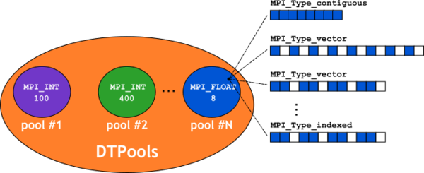
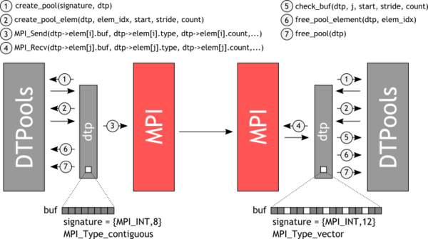
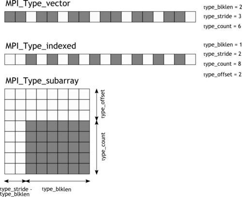

# DTPools

## Introduction

This document lays out the design of the DTPools library. The DTPools
library provides MPICH with a set of APIs that can be used to build new
datatype instances for testing in point-2-point, collective and rma
communications, such as `MPI_Send` and `MPI_Recv`, `MPI_Bcast`, etc.

## Design Requirements

The DTPools library aims at providing a comprehensive and flexible
infrastructure for the testing of different datatypes. In order to
achieve such flexibility DTPools defines different pools of datatypes,
each having a defined datatype signature (i.e., basic type + count).
Inside a pool several datatypes instances, with derived datatype and
layout (defined internally in the library but more can be easily added
if needed), are possible. Each pair of datatypes can be randomly picked
from one pool and used in MPI communications. Beside picking a pair of
datatypes from the same pool, it should be also possible to pick two
datatypes from different pools, as long as they have the same basic type
(e.g., `MPI_INT`), and use them in pt2pt communications (only). In this
specific case, since the signature is different, the difference will be
in the number of basic types (i.e., the count).

In order to support the described requirements the library should
provide a mechanism that allows the user to initialize buffers, possibly
with different values. Indeed, it should be possible to initialize a
buffer starting from a specific value and then assign adjacent elements
incremental values. For example:

```
val_start = 10, val_stride =2, val_count= 5
```

would initialize a contiguous buffer as 

```
[10 12 14 16 18]
```

To make sure that data sent with one datatype is received
properly at the other end using a different datatype, the library must
also provide a buffer check mechanism. Such mechanism should support the
case of datatypes from different pools for pt2pt communications as well.
This means that the count parameter should be also used to limit the
buffer checking to a subset of the sent buffer.



## Architecture

Following the previously defined requirements here we outline the
architecture of the library, this boils down to the definition of the
interfaces and how they operate. The following figure shows a simple use
case in which two pools with same basic type are initialized and from
which two different types `i` and `j` are picked for a send/recv
test.



First of all we need to provide an interface that initializes a datatype
pool. Once such interface is available a 'pool' of pools can be defined
as array of pool objects. The pool provides an initially empty container
for datatypes. Once the container is initialized it has to be filled
with datatypes. Filling the container at pool creation time would not
make sense since it would allocate potentially large amount of memory
for objects that are only used once and then can be discarded. For this
reason a better choice is to provide an element create function that can
be invoked on a specific element to create it (including initializing
the corresponding buffer) only when such element is needed. Once an
element has been created it can be used to send or receive data. At the
receiver side there is an extra step needed. When the buffer is received
it must be checked to make sure that data inside it is correct. Finally
when the datatype is no longer needed its space inside the pool should
be freed using the appropriate element free function. Similarly, when
all the datatypes in the pool have been tested the pool should be freed.

The proposed basic interface for the previously described use case
follows:

```
int DTP_pool_create(MPI_Datatype basic_type, int basic_count, DTP_t *dtp)
    Create a new basic pool with defined datatype signature.
    - basic_type:   native datatype part of signature
    - basic_count:  native datatype count part of signature
    - dtp:          datatype pool object
```

```
int DTP_pool_create_struct(int basic_type_count, MPI_Datatype *basic_types, int *basic_counts, DTP_t *dtp)
    Create a new struct pool with defined signature.
    - basic_type_count:  number of native datatypes in struct
    - basic_type:        array of native datatypes
    - basic_counts:      array of native datatype counts
    - dtp:               datatype pool object
```

```
int DTP_pool_free(DTP_t dtp)
    Free a previously created datatype pool.
    - dtp:  datatype pool object
```

```
int DTP_obj_create(DTP_t dtp, int obj_idx, int val_start, int val_stride, int val_count)
    Create a datatype object (at index obj_idx) inside the specified pool. Also initialize`
    the buffer elements using start, stride and count.
    - dtp:          datatype pool object
    - obj_idx:      number of datatype inside the pool to be created
    - val_start:    start of initialization value for buffer at index obj_idx
    - val_stride:   increment for next element in buffer
    - val_count:    total number of elements to be initialized in buffer
```

```
int DTP_obj_free(DTP_t dtp, int obj_idx)
    Free a previously created datatype object inside the specified pool.
    - dtp:      datatype pool object
    - obj_idx:  number of datatype inside the pool to be freed
```

```
int DTP_obj_buf_check(DTP_t dtp, int obj_idx, int val_start, int val_stride, int val_count)
    Checks whether the received buffer (used in communication routine) matches the sent buffer.
    - dtp:          datatype pool object
    - obj_idx:      number of datatype inside the pool to be checked
    - val_start:    start of checking value for buffer at index obj_idx
    - val_stride:   increment for next checked element in buffer
    - val_count:    total number of elements to be checked in buffer
```

**Use Case Example**

``` c
/* variable declaration */

DTP_t send_dtp, recv_dtp;

MPI_Init(NULL, NULL);
MPI_Comm_rank(MPI_COMM_WORLD, &rank);

err = DTP_pool_create(MPI_INT, 1024, &send_dtp);
if (err != DTP_SUCCESS) {
    /* error handling */;
}

err = DTP_pool_create(MPI_INT, 2048, &recv_dtp);
if (err != DTP_SUCCESS) {
    /* error handling */;
}

for (i = 0; i < send_dtp->DTP_num_objs; i++) {
    err = DTP_obj_create(send_dtp, i, 0, 2, 1024);
    if (err) {
        /* error handling */;
    }
    for (j = 0; j < recv_dtp->DTP_num_objs; j++) {
        err = DTP_obj_create(dtp, j, 0, 0, 0);
        if (err != DTP_SUCCESS) {
            /* error handling */;
        }

        MPI_Irecv(recv_dtp->DTP_obj_array[j].DTP_obj_buf,
                  recv_dtp->DTP_obj_array[j].DTP_obj_count,
                  recv_dtp->DTP_obj_array[j].DTP_obj_type,
                  rank, 0, MPI_COMM_WORLD, &req);

        MPI_Send(send_dtp->DTP_obj_array[i].DTP_obj_buf,
                 send_dtp->DTP_obj_array[i].DTP_obj_count,
                 send_dtp->DTP_obj_array[i].DTP_obj_type,
                 rank, 0, MPI_COMM_WORLD);

        MPI_Wait(&req, MPI_STATUS_IGNORE);

        if (DTP_obj_buf_check(recv_dtp, j, 0, 2, 1024) != DTP_SUCCESS) {
            /* error handling */;
        }

        DTP_obj_free(recv_dtp, j);
    }
    DTP_obj_free(send_dtp, i);
}

DTP_pool_free(send_dtp);
DTP_pool_free(recv_dtp);

MPI_Finalize();
```

**Limiting the number of datatypes in a pool**

In order to limit the number of datatypes inside a pool the user can set
the environment variable `DTP_NUM_OBJS = [NUM]`, where `NUM` is
the desired value. This will cap the number of datatypes returned by
`DTP_num_objs`, as in the previous example, to `NUM` if this is
lesser than the default pool size (-1 can be also used to indicate full
pool size). The layouts are picked in incremental order, where the order
is defined by the list of layouts reported in the following section.

## DTPools Datatype Layouts

DTPools must support the widest range of basic datatypes and derived
datatypes. For derived datatypes additional structures (layouts) should
be also provided. The following list of basic and derived datatype
should be supported:

**Basic Datatypes**:

- `MPI_CHAR`
- `MPI_BYTE`
- `MPI_WCHAR`
- `MPI_SHORT`
- `MPI_INT`
- `MPI_LONG`
- `MPI_LONG_LONG_INT`
- `MPI_UNSIGNED_CHAR`
- `MPI_UNSIGNED_SHORT`
- `MPI_UNSIGNED`
- `MPI_UNSIGNED_LONG`
- `MPI_UNSIGNED_LONG_LONG`
- `MPI_FLOAT`
- `MPI_DOUBLE`
- `MPI_LONG_DOUBLE`
- `MPI_INT8_T`
- `MPI_INT16_T`
- `MPI_INT32_T`
- `MPI_INT64_T`
- `MPI_UINT8_T`
- `MPI_UINT16_T`
- `MPI_UINT32_T`
- `MPI_UINT64_T`
- `MPI_C_COMPLEX`
- `MPI_C_FLOAT_COMPLEX`
- `MPI_C_DOUBLE_COMPLEX`
- `MPI_C_LONG_DOUBLE_COMPLEX`
- `MPI_FLOAT_INT`
- `MPI_DOUBLE_INT`
- `MPI_LONG_INT`
- `MPI_2INT`
- `MPI_SHORT_INT`
- `MPI_LONG_DOUBLE_INT

**Derived Datatypes**:

- `MPI_Type_contiguous`
- `MPI_Type_vector`
- `MPI_Type_indexed`
- `MPI_Type_create_hvector`
- `MPI_Type_create_hindexed`
- `MPI_Type_create_indexed_block`
- `MPI_Type_create_hindexed_block`
- `MPI_Type_create_subarray`
- `MPI_Type_create_struct`

For derived datatypes we also have several possible layouts that are
defined as follow:

- Simple layouts

```
DTPI_OBJ_LAYOUT_SIMPLE__BASIC:                   type_count = basic_type_count; type_stride = -; type_blklen = -;
DTPI_OBJ_LAYOUT_SIMPLE__CONTIG:                  type_count = 1; type_stride = -; type_blklen = basic_type_count;
DTPI_OBJ_LAYOUT_SIMPLE__VECTOR:                  type_count = basic_type_count; type_stride = 2; type_blklen = 1;
DTPI_OBJ_LAYOUT_SIMPLE__INDEXED:                 type_count = basic_type_count; type_stride = 2; type_blklen = 1;
DTPI_OBJ_LAYOUT_SIMPLE__BLOCK_INDEXED:           type_count = basic_type_count; type_stride = 2; type_blklen = 1;
DTPI_OBJ_LAYOUT_SIMPLE__HVECTOR:                 type_count = basic_type_count; type_stride = 2; type_blklen = 1;
DTPI_OBJ_LAYOUT_SIMPLE__HINDEXED:                type_count = basic_type_count; type_stride = 2; type_blklen = 1;
DTPI_OBJ_LAYOUT_SIMPLE__BLOCK_HINDEXED:          type_count = basic_type_count; type_stride = 2; type_blklen = 1;
```

- Large block/count layouts

```
DTPI_OBJ_LAYOUT_LARGE_BLK__VECTOR:               type_count = small; type_blklen = large; type_stride = type_blklen + 1;
DTPI_OBJ_LAYOUT_LARGE_BLK__INDEXED:              type_count = small; type_blklen = large; type_stride = type_blklen + 1;
DTPI_OBJ_LAYOUT_LARGE_BLK__BLOCK_INDEXED:        type_count = small; type_blklen = large; type_stride = type_blklen + 1;
DTPI_OBJ_LAYOUT_LARGE_BLK__HVECTOR:              type_count = small; type_blklen = large; type_stride = type_blklen + 1;
DTPI_OBJ_LAYOUT_LARGE_BLK__HINDEXED:             type_count = small; type_blklen = large; type_stride = type_blklen + 1;
DTPI_OBJ_LAYOUT_LARGE_BLK__BLOCK_HINDEXED:       type_count = small; type_blklen = large; type_stride = type_blklen + 1;
DTPI_OBJ_LAYOUT_LARGE_BLK__SUBARRAY_C:           type_count = small; type_blklen = large; type_stride = type_blklen + 1;
DTPI_OBJ_LAYOUT_LARGE_BLK__SUBARRAY_F:           type_count = small; type_blklen = large; type_stride = type_blklen + 1;
DTPI_OBJ_LAYOUT_LARGE_CNT__VECTOR:               type_count = large; type_blklen = small; type_stride = type_blklen + 1;
DTPI_OBJ_LAYOUT_LARGE_CNT__INDEXED:              type_count = large; type_blklen = small; type_stride = type_blklen + 1;
DTPI_OBJ_LAYOUT_LARGE_CNT__BLOCK_INDEXED:        type_count = large; type_blklen = small; type_stride = type_blklen + 1;
DTPI_OBJ_LAYOUT_LARGE_CNT__HVECTOR:              type_count = large; type_blklen = small; type_stride = type_blklen + 1;
DTPI_OBJ_LAYOUT_LARGE_CNT__HINDEXED:             type_count = large; type_blklen = small; type_stride = type_blklen + 1;
DTPI_OBJ_LAYOUT_LARGE_CNT__BLOCK_HINDEXED:       type_count = large; type_blklen = small; type_stride = type_blklen + 1;
DTPI_OBJ_LAYOUT_LARGE_CNT__SUBARRAY_C:           type_count = large; type_blklen = small; type_stride = type_blklen + 1;
DTPI_OBJ_LAYOUT_LARGE_CNT__SUBARRAY_F:           type_count = large; type_blklen = small; type_stride = type_blklen + 1;
DTPI_OBJ_LAYOUT_LARGE_BLK_STRD__VECTOR:          type_count = small; type_blklen = large; type_stride = type_blklen * 2;
DTPI_OBJ_LAYOUT_LARGE_BLK_STRD__INDEXED:         type_count = small; type_blklen = large; type_stride = type_blklen * 2;
DTPI_OBJ_LAYOUT_LARGE_BLK_STRD__BLOCK_INDEXED:   type_count = small; type_blklen = large; type_stride = type_blklen * 2;
DTPI_OBJ_LAYOUT_LARGE_BLK_STRD__HVECTOR:         type_count = small; type_blklen = large; type_stride = type_blklen * 2;
DTPI_OBJ_LAYOUT_LARGE_BLK_STRD__HINDEXED:        type_count = small; type_blklen = large; type_stride = type_blklen * 2;
DTPI_OBJ_LAYOUT_LARGE_BLK_STRD__BLOCK_HINDEXED:  type_count = small; type_blklen = large; type_stride = type_blklen * 2;
DTPI_OBJ_LAYOUT_LARGE_BLK_STRD__SUBARRAY_C:      type_count = small; type_blklen = large; type_stride = type_blklen * 2;
DTPI_OBJ_LAYOUT_LARGE_BLK_STRD__SUBARRAY_F:      type_count = small; type_blklen = large; type_stride = type_blklen * 2;
DTPI_OBJ_LAYOUT_LARGE_CNT_STRD__VECTOR:          type_count = large; type_blklen = small; type_stride = type_count  * 2;
DTPI_OBJ_LAYOUT_LARGE_CNT_STRD__INDEXED:         type_count = large; type_blklen = small; type_stride = type_count  * 2;
DTPI_OBJ_LAYOUT_LARGE_CNT_STRD__BLOCK_INDEXED:   type_count = large; type_blklen = small; type_stride = type_count  * 2;
DTPI_OBJ_LAYOUT_LARGE_CNT_STRD__HVECTOR:         type_count = large; type_blklen = small; type_stride = type_count  * 2;
DTPI_OBJ_LAYOUT_LARGE_CNT_STRD__HINDEXED:        type_count = large; type_blklen = small; type_stride = type_count  * 2;
DTPI_OBJ_LAYOUT_LARGE_CNT_STRD__BLOCK_HINDEXED:  type_count = large; type_blklen = small; type_stride = type_count  * 2;
DTPI_OBJ_LAYOUT_LARGE_CNT_STRD__SUBARRAY_C:      type_count = large; type_blklen = small; type_stride = type_count  * 2;
DTPI_OBJ_LAYOUT_LARGE_CNT_STRD__SUBARRAY_F:      type_count = large; type_blklen = small; type_stride = type_count  * 2;
```

The following figure shows how the previous structure parameters map to
different derived datatypes.



## Extending DTPools

Extending DTPools with new datatype layouts is as simple as adding the
type descriptor in `test/mpi/dtpools/include/dtpools_internal.h`, the
corresponding type create and buf check functions in
`test/mpi/dtpools/src/dtpools_internal.c`, and including the new
layout to the pool create function in
`test/mpi/dtpools/src/dtpools.c`. Additionally the type create
function should also be added to creators function vector
`DTPI_Init_creators`.

**Example**

```
 /* dtpools_internal.h */
 enum {
     ...,
     DTPI_OBJ_LAYOUT_MYLAYOUT__NESTED_VECTOR,
     ...
 };
 int DTPI_Nested_vector_create(struct DTPI_Par *par, DTP_t dtp);
 int DTPI_Nested_vector_check_buf(struct DTPI_Par *par, DTP_t dtp);

 /* dtpools_internal.c */
 void DTPI_Init_creators(DTPI_Creator * creators) {
     ...
     creators[DTPI_OBJ_LAYOUT_MYLAYOUT__NESTED_VECTOR] = DTPI_Nested_vector_create;
 }
 int DTPI_Nested_vector_create(struct DTPI_Par *par, DTP_t dtp) {
     ...
 }
 int DTPI_Nested_vector_check_buf(struct DTPI_Par *par, DTP_t dtp) {
     ...
 }

 /* dtpools.c */
 int DTP_obj_create(DTP_t dtp, int obj_idx, int val_start, int var_stride, int val_count) {
     ...
     switch(obj_idx) {
         case XXX:
             ...
             break;
         case DTPI_OBJ_LAYOUT_MYLAYOUT__NESTED_VECTOR:
             /* set up parameters for create function */
             par.core.type_count  = X(count); /* signature count */
             par.core.type_blklen = Y(count);
             par.core.type_stride = Z(count);
             break;
         default:;
     }
     ...
 }
```

## Integration with mpich test suite

The new DTPools framework can potentially generate a very large number
of datatype combinations that can take a very long time to be tested. In
order to keep the testing time manageable, instead of having only a few
tests that iterate across all the datatype combinations, we generate
many smaller tests, one for each datatype signature. This is done by
modifying existing tests (e.g., `test/mpi/pt2pt/sendrecv1.c`) to take
basic datatype and count as compilation time parameters. The rules to
generate such parameters are defined in three additional configuration
files:

- `test/mpi/basictypelist.txt`
- `test/mpi/basictypetest.txt` 
- `test/mpi/structtypetest.txt`

`basictypelist.txt` contains a list of all the basic datatypes to be
used for type signatures while `basictypetest.txt` and
`structtypetest.txt` contain, for each source, the rules to build and
run the tests (including additional user defined macros, list of counts
that complete the signature, number of processes and time limit). All
the configuration files are processed by an additional
`test/mpi/autogen.sh` script (invoked by the main MPICH autogen). In
order to allow additional test binaries, `Makefile.am` files in
corresponding test directories (e.g., `test/mpi/pt2pt`) have been
modified to include a `Makefile.dtp` generated by the new autogen
script. The autogen script also generates an additional `testlist.dtp`
file for every test directory. This last one is a temporary file that is
finally merged into a `testlist.in` file which is eventually copied
into the final build directory at configure time. Since the
`testlist.in` file has to contain both old and new tests the old
`testlist.in` have been renamed to `testlist.def`.

Follow an example of the new flow:

```
./autogen.sh
...
contrib/misc/Makefile.am: installing './config/depcomp'
------------------------------------------------------------------------
running third-party initialization in test/mpi
basictypetest.txt:23: Generate tests for: fkeyvaltype.c ... done
basictypetest.txt:24: Generate tests for: bcast.c ... done
basictypetest.txt:25: Generate tests for: bcast.c ... done
basictypetest.txt:26: Generate tests for: fkeyvaltypex.cxx ... done
basictypetest.txt:27: Generate tests for: packsizex.cxx ... done
basictypetest.txt:28: Generate tests for: pingping.c ... done
basictypetest.txt:29: Generate tests for: sendrecv1.c ... done
basictypetest.txt:30: Generate tests for: sendself.c ... done
basictypetest.txt:31: Generate tests for: accfence1.c ... done
basictypetest.txt:32: Generate tests for: accpscw1.c ... done
basictypetest.txt:33: Generate tests for: epochtest.c ... done
basictypetest.txt:34: Generate tests for: getfence1.c ... done
basictypetest.txt:36: Generate tests for: getfence1.c ... done
basictypetest.txt:37: Generate tests for: lock_contention_dt.c ... done
basictypetest.txt:38: Generate tests for: lock_dt.c ... done
basictypetest.txt:39: Generate tests for: lock_dt_flush.c ... done
basictypetest.txt:40: Generate tests for: lock_dt_flushlocal.c ... done
basictypetest.txt:41: Generate tests for: lockall_dt.c ... done
basictypetest.txt:42: Generate tests for: lockall_dt_flush.c ... done
basictypetest.txt:43: Generate tests for: lockall_dt_flushall.c ... done
basictypetest.txt:44: Generate tests for: lockall_dt_flushlocal.c ... done
basictypetest.txt:45: Generate tests for: lockall_dt_flushlocalall.c ... done
basictypetest.txt:46: Generate tests for: lock_contention_dt.c ... done
basictypetest.txt:47: Generate tests for: lock_dt.c ... done
basictypetest.txt:48: Generate tests for: lock_dt_flush.c ... done
basictypetest.txt:49: Generate tests for: lock_dt_flushlocal.c ... done
basictypetest.txt:50: Generate tests for: lockall_dt.c ... done
basictypetest.txt:51: Generate tests for: lockall_dt_flush.c ... done
basictypetest.txt:52: Generate tests for: lockall_dt_flushall.c ... done
basictypetest.txt:53: Generate tests for: lockall_dt_flushlocal.c ... done
basictypetest.txt:54: Generate tests for: lockall_dt_flushlocalall.c ... done
basictypetest.txt:55: Generate tests for: putfence1.c ... done
basictypetest.txt:57: Generate tests for: putfence1.c ... done
basictypetest.txt:58: Generate tests for: putpscw1.c ... done
structtypetest.txt:33: Generate tests for: fkeyvaltype.c ... done
structtypetest.txt:34: Generate tests for: bcast.c ... done
structtypetest.txt:35: Generate tests for: fkeyvaltypex.cxx ... done
...
structtypetest.txt:53: Generate tests for: putfence1.c ... done
structtypetest.txt:54: Generate tests for: putpscw1.c ... done
Generate testlist in dir: attr ... done
Generate testlist in dir: coll ... done
Generate testlist in dir: cxx/attr ... done
Generate testlist in dir: cxx/datatype ... done
Generate testlist in dir: pt2pt ... done
Generate testlist in dir: rma ... done
Generate basictypelist.txt for dtpools ... done
------------------------------------------------------------------------
running third-party initialization in src/izem
...
```

The last line of the script output also notifies users about the
creation of an additional `basictypelist.txt` file for the DTPools
framework. This is used to allow DTPools to be configured with a
variable (and customizable) number of basic datatypes that are added to
a statically allocated array (`DTP_basic_types`) that users can
refer to to build their pools. Such file is referenced by the framework
at configuration time by looking for the `DTP_DATATYPE_FILE`
environment variable. If not set the configuration file uses the default
(i.e., `test/mpi/dtpools/basictypelist.txt`)

## Adding new tests

With the new DTPools framework integrated in the test suite, it is
possible to add more exhaustive datatype tests. To add a new test,
setting the "basic type" and "count" command line parameters is
sufficient.

Starting from the basic test, many different tests for different
signatures can be generated automatically by adding a corresponding
entry for the test in the file: `basictypetest.txt`, following the
format defined by the file itself. Then the tests can be generated by
just running the main `autogen.sh` script.

In case the user wants to run a subset of all the possible tests that
will be generated, he/she can use the `DTP_RUNTIME_TYPES`
environment variable to limit the number of basic types tested by the
`runtest` script. If the user further wishes to reduce the length of
the tests, he/she can also use the `DTP_NUM_OBJS` environment
variable to limit the number of datatypes tested from each pool.
Currently, running `make testing` will limit the default case to only
two basic types (`DTP_RUNTIME_TYPES="MPI_INT MPI_DOUBLE"`) and a pool
size of 5 datatypes, keeping the runtime reasonable without sacrificing
too much test coverage.

DTPools also allows the user to define his/her own struct type pools.
For this case the configuration file to be used to create the
executables is `structtypetest.txt`. Unlike the basic case only one
test will be generated (for now). However, the user can still define
arbitrary structures in the configuration file in a flexible way.
