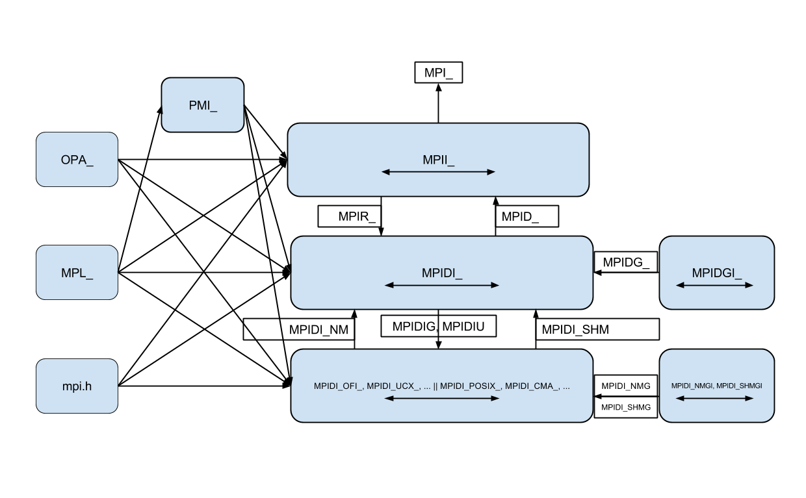

# Function Name Prefix Convention

This page describes the convention for function names in MPICH. The
prefixes to function names indicate at which level the function is
implemented, and by which level it is intended to be used.

I believe that this is how the prefixes were intended to be used:

An interface (e.g., `MPI, ADI3, channel`) is identified by a prefix (e.g.,
`MPI, MPID, MPIDI_CH3`). For a particular interface with prefix `XXX`,
functions with the `XXX_` prefix and `XXXU_` prefix are part of the API,
with the `XXX_` functions being implemented by the lower layer and called
by the upper layer, and the `XXXU_` functions being implemented by the
upper layer to be called by the lower layer (`U` may stand for "upcall").
Functions with the `XXXI_` prefix are not part of the API and are
implemented by the lower layer to be used internally by the lower layer,
and so should not be called directly by the upper layer. E.g. For the
`ADI3` interface, `MPID_` functions are implemented by CH3 and are called
by the MPI layer. `MPIDU_` functions are implemented by the MPI layer and
are called by CH3. CH3 has internal functions which have the `MPIDI_`
prefix. Note that channels are part of the CH3 implementation, and so
all channel functions should have `MPIDI_` prefixes (specifically
`MPIDI_CH3_, MPIDI_CH3I_, etc.`).

Repeating for emphasis: `XXXU_` functions being implemented by the
upper layer to be called by the lower layer (`U` may stand for "upcall")

A little more specifically:

- `MPI_` - Functions are implemented by the MPI level to be used by
  the application
- `MPIU_` - Functions are implemented by the MPI level in `src/util/`
  to be used by the MPI level and below
- `MPIR_` - MPI functionality to be used by the MPI level and below
  (technically a synonym for
  MPIU_?)
- `MPIC_` - MPI Collective helper functions to be used by the MPI
  level only
- `MPID_` - Functions are implemented by the device to be used by the
  MPI level in `src/mpid/`*<device>*
- `MPIDU_` - Device independent functionality (*only?*) in
  `src/mpid/common` or `src/mpid/include` to be *optionally* used by
  the device level and below, but not above.
- `MPIDI_` - Functions are implemented at the device level (in
  `src/mpid/<device>`) to be used in the specific device
  implementing it and below, (not above).
- `MPL_` - MPICH Portability Library - can be used anywhere inside
  MPICH
- `OPA_` - Open Portable Atomics - can be used anywhere inside MPICH
- In the CH3 device:
    - `MPIDI_CH3_` - Functions are implemented by the channel in
      `src/mpid/ch3/<channel>` used by CH3
    - `MPIDI_CH3U_` - Functions are implemented by the CH3 used by
      the channel (*and probably CH3?*) but not above
    - `MPIDI_CH3I_` - Functions are implemented by the channel used
      by the channel but not above.
- In the CH4 device:
    - `MPIDI_CH4` - Functions implemented by CH4 to be used at the
      device level
    - `MPIDI_CH4U_` - *optional* Transport independent functionality
      (e.g. MPICH active message fallback)
    - `MPIDI_CH4I_` - Functions implemented by CH4 to be used by CH4
      but not above

## MPICH 3.3 Greenfield Refactor

NOTE: Prefixes involving CH4 will use lowercase after the prefix. (e.g.
`MPIDI_CH4R_send`)

### Interface Layering

- MPI Layer
    - Up interface - `MPI, MPIX`
    - Down interface - `MPIR`
    - Horizontal interface - `MPII`

- Device Layer
    - Up interface - `MPID`
    - Down interface - `MPIDIR`
    - Horizontal interface - `MPIDI`
    - Generic functionality - `MPIDIG`
- Device Independent (generic) Functionality
    - Up interface - N/A
    - Down interface - N/A
    - Horizontal interface - `MPIDGI`
    - Generic functionality - `MPIDG`

- Netmod Layer
    - Up interface - `MPIDI_NM`
    - Horizontal interface - `MPIDI_OFI, MPIDI_UCX, ...`
    - Generic functionality - `MPIDI_NMG`

- Shmmod Layer
    - Up interface - `MPIDI_SHM`
    - Horizontal interface - `MPIDI_CMA, MPIDI_POSIX, ...`
    - Generic functionality - `MPIDI_SHMG`

### Changes to be made to existing code

- Move independent utilities in `src/util` to MPL
    - Locking primitives
    - `MPL_Malloc, MPL_Free`
    - Timers
    - and others...
- Integrate MPL into `ROMIO`
- Export device fallback code as MPIDU
    - `src/mpid/common/sched`
    - `src/mpid/common/datatype`
    - default collective algorithms
    - and others...
