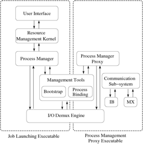
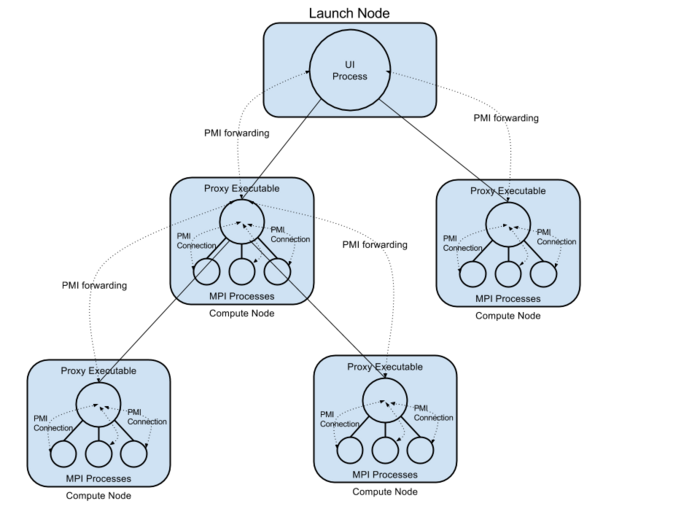

# Hydra Process Management Framework

## Overall Framework

The Hydra framework has the following basic components:

1.  User Interface (UI, e.g., mpiexec)
2.  Resource Management Kernel (RMK)
3.  Process manager
4.  Bootstrap server (e.g., ssh, fork, pbs, slurm, sge)
5.  Process Binding (e.g., plpa)
6.  Communication Subsystem (e.g., IB, MX)
7.  Process Management proxy
8.  I/O demux engine

Architecturally, their relationship is shown in the below figure:

**User Interface:** The main responsibility of this layer is to collect
information from the user with respect to the application, where to
launch the processes, mappings of processes to cores, reading stdin and
forwarding it to the appropriate process(es), reading stdout/stderr from
different processes and directing it appropriately.

**Resource Management Kernel (RMK):** The RMK provides plug-in
capabilities to interact with resource managers (e.g., Torque, Moab or
Cobalt). For example, if the application needs to allocate nodes on a
system before launching a job, the RMK plays this part. Similarly, the
RMK can also allow for decoupled job launching in cases where a single
system reservation is to be used for multiple jobs. In the current
implementation, the RMK is very simple and does not provide any of these
functionalities.

**Process Manager:** The process manager deals with providing processes
with the necessary environment setup as well as the primary process
management functionality. For example, the "pmiserv" process manager
provides the MPICH PMI (Process Management Interface) functionality.
Currently, only PMI-1 is supported, but we plan to add PMI-2 as well
(which is currently being drafted). Other process managers could support
other interfaces.

**Process Management Proxy:** The process management proxy is basically
a helper agent that is spawned at each node on the system to assist the
process manager with process spawning, process cleanup, signal
forwarding, I/O forwarding, and any process manager specific
functionality as well. It can basically perform any task the process
manager can do, thus, even a hierarchy of process management proxies can
be created, where each proxy acts as a process manager for its sub-tree.

**Bootstrap Server:** The bootstrap server mainly functions as a
pre-configured daemon system that allows the upper layers to launch
processes throughout the system. For example, the ssh bootstrap server
forks off processes, each of which performs an ssh to a single machine
to launch one process.

**Processing Binding:** The process binding component essentially deals
with extracting the system architecture information (such as the number
of processors, cores and SMT threads available, their topology, shared
cache, etc.) and binding processes to different cores in a portable
manner. PLPA is one such architecture that is already used in Hydra, but
it provides only limited information. We are currently working on a more
enhanced implementation of this component.

**Communication Subsystem:** The communication sub-system is a way for
different proxies to communicate with each other in a scalable manner.
This is only relevant for the pre-launched and pre-connection proxies
that are described below. This component provides a scalable
communication mechanism irrespective of the system scale (e.g.,
InfiniBand UD based or Myrinet MX based).

**I/O Demux Engine:** This is basically a convenience component, where
different components can "register" their file-descriptors and the demux
engine can wait for events on any of these descriptors. This gives a
centralized event management mechanism; so we do not need to have
different threads blocking for different events. The I/O demux engine
uses a synchronous callback mechanism. That is, with each file
descriptor, the calling processes provides a function pointer to the
function that has to be called when an event occurs on the descriptor.
The demux engine blocks for events on all its registered file
descriptors and calls the appropriate callbacks whenever there is an
event. This component is very useful in the implementation, but does not
play a crucial role in the architecture itself.

## Implementation and Control Flow

There are three basic executable classes in the current model: UI
process, process management proxy and the application process.

**UI Process:** The UI process (e.g., mpiexec) takes the user arguments,
environment settings, information about nodes where the process has to
be launched and other such details provided by the user and passes them
to the RMK. The RMK, if appropriate, interacts with the resource manager
to either verify access to the nodes on which the processes need to be
launched or to allocate the nodes, and passes this information to the
process manager. The process manager creates an executable argument list
to launch the proxy containing information about the application itself
and its arguments, the environment that needs to be setup for the
application and the partition of processing elements that this proxy
would be responsible for. The environment also contains additional
information that can allow the PMI client library on the application to
connect to the process manager. The executable argument list is passed
down to the bootstrap server with information on where all to launch
this executable; in this case, the executable that is handed over to the
bootstrap server is the proxy, but the bootstrap server itself does not
interpret this information and can be used transparently for the proxy
or the application executable directly. The bootstrap server launches
the processes on the appropriate nodes, and keeps track of the stdout,
stderr and stdin end points for these processes. This information is
passed back to the upper layers. Once the processes have been launched,
the UI executable registers the stdout, stderr, stdin file descriptors
with the demux engine and waits for events on them. Once all these
sockets have been closed, it passes the control back to the bootstrap
server that waits for each of the spawned processes to terminate and
returns the exit statuses of these processes.

**Process Management Proxy:** The process management proxy sets up the
required environment and forks off application processes. Proxies can be
setup in a hierarchical fashion. They forward I/O information to/from
the application processes to a parent proxy or the main process manager.
The proxy implements the Process Management Interface (PMI) API and
keeps a local cache of the PMI KVS space. PMI calls made by the
application that cannot be completed locally are forwarded upstream to
the main process manager.

**Process Cleanup During Faults:** There are two types of faults as far
as the Hydra framework is concerned: in one case, either one of the
application processes dies or calls an abort. In the second case, the
timeout specified by the user expires. In both cases, Hydra tries to
clean up all the remaining application processes. Unfortunately, not all
bootstrap servers reliably forward signals to processes (e.g., many ssh
implementations do not forward SIGINT correctly all the time). Thus, the
cleanup has to be manually done by the framework. For this, each proxy
keeps track of the PIDs of the processes that it spawns. Together with
stdout/stderr/stdin, the proxies also listen for connection requests
from the parent proxy or process manager. If the process manager wants
to cleanup the application processes, it can connect to the proxy, and
send it a command to clean up processes associated with it. The proxy
does this and passes back the appropriate exit code. The current
implementation does this cleanup connection sequentially, but this can
be made into a tree.

## Ongoing Work

There are several pieces of ongoing work as described below:

**Integration with other programming models:** A lot of the Hydra
framework is independent of any parallel programming model. Several
tools and utilities, are as easily utilizable by MPI as any other
programming model. For example tools such as process launching,
bootstrap servers, process-core binding, debugger support and many
others are common to all parallel programming models and should not be
repeated in each implementation. As a proof of concept, we are working
on using Hydra with Global Arrays applications. We are also considering
extending it to work with other models as well.

**Pre-launched and Pre-connected Proxies:** One of the issues on process
management on large scale systems is the time taken to launch processes
as well as initiating their interaction. For example, in the case of
MPICH, even after the application processes have been launched, each
process does not know anything about the other processes. Thus, it has
to interact with the process manager which exchanges this information.
This is typically at start time, so is not noticed in benchmark
performance numbers, but as system sizes grow larger, this can be a
major concern. In our pre-launched and pre-connected proxy model, we
allow the proxies to be launched by a system administrator (or the user
himself) when at "initialization time", i.e., one initialization is
sufficient to run any number of jobs. Once launched, the proxies connect
with each other. For scalable network stacks such as Myrinet MX and
InfiniBand UD, the amount of resources used does not increase largely
with the system size, so an all-to-all connection is preferred. Once
connected, each proxy can interact with any other proxy to exchange
information with a single hop, thus allowing the applications to be not
affected by system scale in a lot of aspects.

**Hierarchical Proxies:** For the non-pre-launched proxies, currently,
they are launched in a one-level hierarchy (each proxy handles the
processes on its node and is connected to the main mpiexec).

## Short Term Future Plans

1.  **Executable Staging:** Currently, it is expected that the
    executable required to launch a process is available on all systems.
    This is not true for systems that do not share a common file-system.
    Executable staging ships the executable binary to the compute node
    at run-time.
