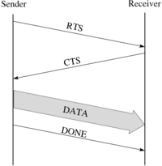
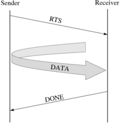
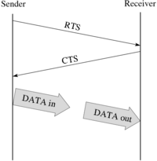

# Nemesis Network Module API

This document describes the Nemesis network module API. Nemesis allows a
process to use multiple network interfaces. However, only one network
interface can be used for one destination, e.g., sending a message to
one destination using two network modules is not supported.

## Initialization and Finalization

```
int MPID_nem_net_module_init (MPIDI_PG_t *pg_p, int pg_rank, 
                              char **bc_val_p, int *val_max_sz_p)
int MPID_nem_net_module_finalize (void);
int MPID_nem_net_module_ckpt_shutdown (void);
int MPID_nem_net_module_get_business_card (int my_rank, char **bc_val_p, int *val_max_sz_p);
int MPID_nem_net_module_connect_to_root (const char *business_card, MPIDI_VC_t *new_vc);
int MPID_nem_net_module_vc_init (MPIDI_VC_t *vc, const char *business_card);
int MPID_nem_net_module_vc_destroy(MPIDI_VC_t *vc);
```

Descriptions needed.

```
int MPID_nem_net_module_vc_terminate(MPIDI_VC_t *vc);
```

This function is called when CH3 has closed the VC. The netmod should
allow any pending sends to complete and close the connection. (Note that
in a connectionless network, there may be nothing to close, so
essentially this means that the VC should be returned to the state it
was in immediately after `vc_init()`.) The VC may be used for
communication again later.Once all pending sends have been sent and the
connection is closed, the netmod should call
`MPIDI_CH3U_Handle_connection(vc, MPIDI_VC_EVENT_TERMINATED)`.

The netmod must not block in this function waiting for sends to
complete. If there are pending sends, the netmod should return from this
function and call `MPIDI_CH3U_Handle_connection()` once the sends have
completed, e.g., from `net_module_poll()`.

```
int MPID_nem_net_module_get_ordering(int *ordering);
```

This API allows netmod to expose the ordering of Active-Messages-based
(AM-based) operations (**am_ordering**). A netmod may issue some
packets via multiple connections in parallel (such as RMA), and those
packets can be unordered. In such case, the netmod should return 0 from
get_ordering function; otherwise, the netmod returns 1 from
get_ordering function. The default value of **am_ordering** in MPICH
is 0. Setting it to 1 may improve the performance of runtime because it
does not need to maintain ordering among AM-based operations. One
example of implementing the API in MXM netmod is as follows:

``` c
int MPID_nem_mxm_get_ordering(int *ordering)
{
  (*ordering) = 1;
  return MPI_SUCCESS;
}
```

When **am_ordering** is 1, the MPICH runtime only issues a REQ_ACK at
last when it wants to detect remote completion of all operations; when
**am_ordering** is 0, the runtime needs to issue a REQ_ACK with every
issued operations to ensure that any future remote completion detection
will be correct.

## Sending

```
int iSendContig( MPIDI_VC_t *vc, MPID_Request *sreq, void *hdr, 
                 MPIDI_msg_sz_t hdr_sz, void *data, MPIDI_msg_sz_t data_sz )
```

- Return Value
    - `MPICH Error Code`
- Parameters
    - `vc` - Pointer to VC corresponding to the destination process
    - `sreq` - Pointer to request for this message; created by caller
    - `hdr` - Pointer to message header
    - `hdr_sz` - Length of header
    - `data` - Pointer to message data
    - `data_sz` - Length of message data

Sends a contiguous message. This function is non-blocking. It is the
responsibility of the network module to ensure that a message which
cannot be sent immediately is eventually sent.

If the entire message is completely send in this function, the function
will complete the request as described below in
[Completing Send Requests](#completing-send-requests).

Implementation note 1: The network module can enqueue the request in an
internal queue to keep track of messages waiting to be sent.

Implementation note 2: The length of the message may be larger than the
eager limit set in the VC.

```
int iStartContigMsg( MPIDI_VC_t *vc, void *hdr, MPIDI_msg_sz_t hdr_sz,
                     void *data, MPIDI_msg_sz_t data_sz, MPID_Request **sreq_ptr )
```

- Return Value
    - `MPICH Error Code`
- Parameters
    - `vc` - Pointer to VC corresponding to the destination process
    - `hdr` - Pointer to message header
    - `hdr_sz` - Length of header
    - `data` - Pointer to message data
    - `data_sz` - Length of message data
    - `sreq_ptr` - Pointer to request returned if message cannot be
      immediately sent, NULL otherwise

Sends a contiguous message. This function is non-blocking. If this
function cannot send the message immediately it will create a request
and return it to the caller through `sreq_ptr`. It is the responsibility
of the network module to ensure that such a message is eventually sent.
If the message is able to be sent immediately, the function will set
`sreq_ptr` to `NULL`.

The difference between this function and `iSendContig()` is that this
function creates a request only when the message cannot be immediately
sent. This allows MPICH to possibly avoid the overhead of creating a
request for blocking MPI send functions.

Implementation note: The length of the message may be larger than the
eager limit set in the VC.

```
int SendNoncontig (MPIDI_VC_t *vc, MPID_Request *sreq, void *header,
                   MPIDI_msg_sz_t hdr_sz);
```

- Return value
    - `MPICH Error Code`
- Parameters
    - `vc - Pointer to VC corresponding to the destination process
    - `sreq - Pointer to request for this message; created by caller
    - `header` - Pointer to message header
    - `hdr_sz` - Length of header

This function sends a non-contiguous message. This function is
non-blocking. The caller creates the request and initializes the
datatype segment structure which describes the non-contiguous data to be
sent.

If the entire message is completely send in this function, the function
will complete the request as described below in 
[Completing Send Requests](#completing-send-requests).

Implementation note: The network module should use the segment
manipulation functions, such as `MPIDI_CH3U_Request_load_send_iov()` or
`MPID_Segment_pack()`, to create iovs or pack the data into a send
buffer. The network module can also implement it's own segment
manipulation operations if needed.

Implementation note: The length of the message may be larger than the
eager limit set in the VC.

### Completing Send Requests

If a message has a request associated with it, once the data for the
message has been completely sent, the request's `OnDataAvail` callback
should be called. If the callback is NULL, the request should be marked
complete using `MPIDI_CH3U_Request_complete()`. If the callback
indicates that the request is not complete, then there is more data to
be sent. The network module should check the request for the additional
data to send. Below is sample code that illustrates this:

``` c
int complete = 0;
int (*reqFn)(MPIDI_VC_t *, MPID_Request *, int *);

reqFn = sreq->dev.OnDataAvail;
if (!reqFn) {
    /* there is no callback fn: complete request and we're done */
    MPIDI_CH3U_Request_complete(sreq);
    goto fn_exit;
}
/* call callback */
mpi_errno = reqFn(vc, sreq, &complete);
if (mpi_errno) MPIU_ERR_POP(mpi_errno);

if (complete)
   /* it's complete, we're done */
   goto fn_exit;
/* otherwise, check for more data to send */
```

## Receiving

When the network module receives data from the network, it will call
`MPID_nem_handle_pkt()` on the data. `MPID_nem_handle_pkt()` can be
called on a buffer containing any number of packets, or on a packet
fragment. E.g., if a large packet is received as separate chunks, the
netmod can call `MPID_nem_handle_pkt()` once for each chunk received.
The network module must ensure that the order is preserved on the data
passed into the function. When the function returns, the network module
can reuse the buffer.

The function prototype is shown below.

```
int MPID_nem_handle_pkt(MPIDI_VC_t *vc, char *buf, MPIDI_msg_sz_t buflen)
```

- Return value
    - `MPICH Error Code`
- Parameters
    - `vc` - Pointer to VC on which this packet was received
    - `buf` - Pointer to received date
    - `buflen` - Number of bytes received

`MPID_nem_handle_pkt()` will call the appropriate packet handler
functions, and buffer any packet fragments. Note that this function
assumes that packet headers are exactly `sizeof(MPIDI_CH3_Pkt_t)`.
Nemesis adds three fields in the VC to keep track of partially received
messages:

- `recv_active` - Points to the request corresponding to the message
  currently being received, or NULL if there is no
  partially received message. Set by `MPID_nem_handle_pkt()`
- `pending_pkt` - When a message fragment has been received, if the
  entire header has not yet been received, the packet handler function
  cannot be called. In that case, the header fragment is copied into
  this buffer.
- `pending_pkt_len` - Number of bytes in the `pending_pkt` buffer

Invariant: If `pending_pkt_len > 0`, `recv_active` must be NULL. Any
request pointed to by `recv_active` must be completed before the next
message can be received, so you'd never start receiving header fragments
into `pending_pkt` while there is an active receive request.

Possible optimization: When the network module receives data and the
`recv_active` field has been set, the network module may directly
receive the data into the user buffer described in the `recv_active`
request, rather than call `MPID_nem_handle_pkt()`. E.g., with sockets,
the network module can call `readv()` with the IOV generated from the
segment in the `recv_active` request to receive the data directly into
the user buffer, as opposed to receiving it into an internal receive
buffer and calling `MPID_nem_handle_pkt()` to copy it out. When all of
the data for the request has been received, the request must be
completed. See the tcp module for an example. Not all network modules
can make use of this optimization. For such network modules, the LMT
interface can be used to avoid copies.

### Polling

```
int MPID_nem_net_module_poll( MPID_nem_poll_dir_t in_or_out )
```

- Return value
    - `MPICH Error Code`
- Parameters
    - `in_or_out` - Allows caller to specify whether the network
      module should check for incoming messages before sending any
      pending messages (`MPID_NEM_POLL_IN`) or vice versa
      (`MPID_NEM_POLL_OUT`)

This functions is called periodically by Nemesis to allow the network
module to make progress sending and receiving messages.

## Large Message Transfer (LMT)

Using the send and receive functions described above may not allow an
implementation to optimize transferring large messages. E.g., user-level
networks often support zero-copy transfers using RDMA operations, which
require memory registration and the exchange of addresses or memory
keys. The LMT interface is designed to support various transfer modes to
allow the netmod implementor to implement one that is optimal for that
specific netmod.

### Transfer Modes

There are four transfer modes we considered:

- `Null` - Network does not use special transfer modes, e.g.,
  sockets. (Default)
- `Put` - Sender performs the transfer from the local user buffer to
  the remote user buffer on the receiver, e.g., using RDMA put.
- `Get` - Receiver performs the transfer from the remote buffer on
  the sender to the local buffer on the receiver, e.g., using RDMA
  get.
- `Cooperative` - Both the sender and receiver actively participate
  in the transfer, e.g., copying through a buffer in shared memory.

Below, we describe the modes in more detail. Note that the descriptions
below aren't necessarily the only ways one can use the LMT interface,
they are just the ones we had in mind when we designed LMT. There may be
other ways to use the interface that would better fit a particular
network.

#### Null

This is the default mode. CH3 uses a rendezvous protocol transparently
to the lower layer. The RTS, CTS, and data are sent using the send
routines described in the previous section. The netmod need not
implement or override any of the functions described below to use this
mode.

#### Put



This mode is used to support the following scenario where the sender
performs the actual transfer of data, as illustrated by the figure on
the right.

The sender sends an RTS message to the receiver. When the RTS message is
matched, the receiver sends a CTS message back to the sender, along with
any information the sender would need to deliver the data into the
target buffer, e.g., buffer address, datatype and memory keys. The
sender delivers the data to the destination buffer, e.g., using an RDMA
put operation, then sends a DONE message to the receiver. When the
receiver receives the DONE message, the receiver knows the transfer has
completed and completes the request.

[xfig source of image](Media:put.fig.txt "wikilink")


#### Get



This mode is used to support the following scenario where the receiver
performs the actual transfer of data, as illustrated by the figure on
the right.

The sender sends an RTS message to the receiver along with any
information the receiver would need to read the data from the source
buffer, e.g., buffer address, datatype and memory keys. When the RTS
message is matched on the receiver, this retrieves the data from the
source buffer, e.g., using an RDMA get operation, then sends a DONE
message to the sender. When the sender receives the DONE message, the
sender knows the transfer has completed and completes the request.

[xfig source of image](Media:get.fig.txt "wikilink")


#### Cooperative



This mode is used to support the following scenario where both the
sender and receiver actively participate in transferring the data, as
illustrated by the figure on the right.

The sender sends an RTS message to the receiver. When the RTS message is
matched, the receiver sends a CTS back to the sender. Depending on the
method used to transfer the data, either the sender or receiver, or
both, will include information in the RTS or CTS messages that the other
needs to set up the transfer. For example, if the data is to be
transferred by copying through a shared-memory buffer, the receiver
could mmap a file to contain the buffer, initialize it, then send the
sender the name of the mmapped file in the CTS message. When the sender
receives the CTS message, it would mmap the file, and start copying the
data. The sender and receiver would alternate copying in and out until
the entire data is transferred. At that point, both sides know that the
transfer has completed, so no DONE messages need to be sent.

[xfig source of image](Media:coop.fig.txt "wikilink")


### API

Each of the following functions is a function pointer that is a member
of the MPIDI_CH3I_VC (nemesis channel private) structure in each VC.
See  for the definitions.

These function pointers should be set by the network module at vc_init
time. If these function pointers are set to NULL, the *Null* mode is
used.

#### lmt_initiate_lmt

```c
int (* lmt_initiate_lmt)(struct MPIDI_VC *vc, union MPIDI_CH3_Pkt *rts_pkt, struct MPID_Request *req);
```

Called on the LMT sender side to initiate the LMT. This function is
responsible for sending the Ready-To-Send (RTS) message, along with an
optional cookie, to the LMT receiver using the
`MPID_nem_lmt_send_RTS(vc, rts_pkt, s_cookie_buf, s_cookie_len)` macro.

- `vc` - The VC representing the connection between the current process (the
  LMT sender) and the LMT receiver.
- `rts_pkt` - The packet that should be passed to `MPID_nem_lmt_send_RTS`.
- `req` - This is the request object corresponding to the `MPI_Send` call.
  This contains the information about what data should be sent.

#### lmt_start_recv

```c
int (* lmt_start_recv)(struct MPIDI_VC *vc, struct MPID_Request *req, MPID_IOV s_cookie);
```

Called on the LMT receiver side when an RTS message is received and
matched. In the *Put* or *Cooperative* modes, this function should send
a Clear-To-Send (CTS) message, along with an optional cookie, to the LMT
sender using the `MPID_nem_lmt_send_CTS(vc, rreq, r_cookie_buf,
r_cookie_len)` macro. In the *Get* mode, the receiver should start
transferring data at this point.

- `vc` - The VC representing the connection between the current
  process (the LMT receiver) and the LMT sender.
- `req` - The matching receive request. The message data should be
  placed into the buffer indicated by this request.
- `s_cookie` - This is the cookie that was sent by the LMT sender as
  part of the RTS message. It may be NULL if no cookie was sent. This
  is not in persistent storage, so a copy of the cookie must be made
  if the implementation needs access to it after the function returns.

#### lmt_start_send

```c
int (* lmt_start_send)(struct MPIDI_VC *vc, struct MPID_Request *sreq, MPID_IOV r_cookie);
```

Called on the LMT sender side when a CTS message is received. Note that
in the *Get* mode, no CTS will be sent. In the *Put* and *Cooperative*
modes the sender should start transferring the data at this point.

- `vc` - The VC representing the connection between the current
  process (the LMT sender) and the LMT receiver.
- `sreq` - This is the request object corresponding to the `MPI_Send`
  call. This contains the information about what data should be
  sent.
- `r_cookie` - The cookie from the LMT receiver via the CTS message.
  This will be NULL if no cookie was sent. This is not in persistent
  storage, so a copy of the cookie must be made if the implementation
  needs access to it after the function returns.

#### lmt_handle_cookie

```c
int (* lmt_handle_cookie)(struct MPIDI_VC *vc, struct MPID_Request *req, MPID_IOV cookie);
```

Called whenever a COOKIE message is received. COOKIE message can be sent
via the `MPID_nem_lmt_send_COOKIE(vc, rreq, r_cookie_buf, r_cookie_len)`
macro. This mechanism can be used to change cookies mid-transfer, which
might be useful, e.g., if the entire user buffer is not registered all
at once, and is instead registered and deregistered in sections. In such
a case new registration keys must be exchanged during the transfer.

- `req` - The request associated with the LMT. This will be a send
  request on the sender side and a receive request on the receiver
  side.
- `cookie` - A single-element IOV that contains the actual cookie.
  This is not in persistent storage, so a copy of the cookie must be
  made if the implementation needs access to it after the function
  returns.

#### lmt_done_send and lmt_done_recv

```c
int (* lmt_done_send)(struct MPIDI_VC *vc, struct MPID_Request *req);
int (* lmt_done_recv)(struct MPIDI_VC *vc, struct MPID_Request *req);
```

These functions are called when a DONE packet is received. A DONE packet
can be sent via the `MPID_nem_lmt_send_DONE(vc, rreq)` macro. This
provides a means to signal completion of the transfer, such as after an
RDMA operation completes.
