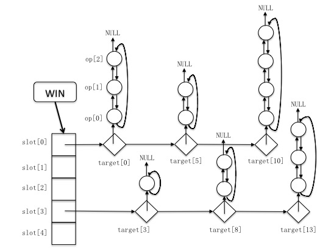
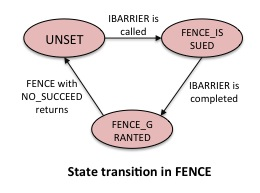
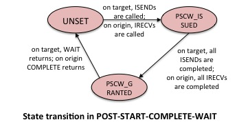
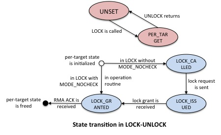
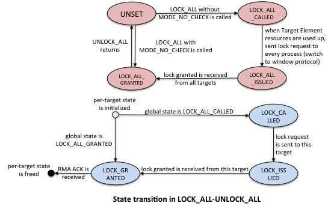

## Goals

The goals of the RMA infrastructure are as follows:

1.  No usage of O(P) data structures, where 'P' is the number of
    processes. Data structure sizes should be constant and
    user-configurable. General rule is that the user should be able to
    use more memory to achieve better performance.
2.  Reduce redundant messages where possible (e.g., extra acknowledgment
    packets).
3.  Reduce process synchronization where possible (e.g., FENCE need not
    always be synchronizing).
4.  Ensure code is thread-safe (e.g., avoid thread-private data
    structures).
5.  Ensure integration of RMA code into the overall MPICH progress
    engine.
6.  Use hardware support for RMA.
7.  Resource management to prevent using up all resources.

## Data structures

**1. Overview**:

We use a new 3D data structure, **Operation Table**, to store posted RMA
operations.



There are the following kinds of data structures involved:

**(1) Operation Element**:
contains all origin/target information needed for
this RMA operation, plus a request handle that is set when the operation
is issued (and has not completed immediately). When the user posts a new
operation, the runtime creates and enqueues a new operation structure to
the corresponding operation list; when this operation is completed, the
runtime dequeues and frees the operation structure from the list.

If req is a NULL pointer, this operation is a PENDING operation; if req
is a non-NULL pointer, this operation is a ISSUED operation.

Note that currently operation list is a double-direction linked list,
the prev pointer of head points to the tail, and the next pointer of
tail is NULL. We may need to make op list as a single-direction linked
list, and store tail pointer in target element.

```
struct OP_ELEM {
    all OP information;
    MPID_Request *req;
    struct OP_ELEM *next, *prev;
 }
```

(From Prof. Gropp's comments) We may need to consider lightweight
request design for RMA. Current version of request has higher overhead.
For example, we should not always initialize/erase all areas when
creating/freeing a request, but should only initialize/erase areas we
needed.

**(2) Target Element**:
contains pointer to an operation list that stores
all RMA operations to the same target. It also contains the epoch state
of the target in cases where a per-target epoch is used (details below).
When the origin first communicates with a target, MPICH creates and
enqueues a new target element to the corresponding target list. When the
origin finishes communication with that target, or all internal
resources for targets are used up, MPICH dequeues and frees the target
element.

```
struct TARGET_ELEM {
    struct OP_ELEM *op_list;
    struct OP_ELEM *next_op_to_issue;
    struct TARGET_ELEM *next;
    int rank;
    int ack_counter;   // for passive target
    int op_count;
    int sync_flag; // UNLOCK/FLUSH/FLUSH_LOCAL, for piggybacking
    int lock_state; // LOCK_CALLED/LOCK_ISSUED/LOCK_GRANTED 
    int lock_type; // SHARED/EXCLUSIVE
    int lock_mode; // MODE_NO_CHECK
}
```

**(3) Slot**:
contains pointer to a target list. Distribution of targets among slots is
currently round-robin. During window creation, MPICH allocates a
fixed-sized slot array on the window (size of slot array is controllable
by the user).

```
struct SLOT {
    struct TARGET_ELEM * targets_list;
}
```

**(4) Window**:
contains at least the following information:

```
struct WIN {
    int win_state;  // window state
    int mode;  // for MODE_NOCHECK for LOCKALL case
    int ack_counter;   // for active target
    int num_nonempty_slots;   // how many slots have non-NULL target list to avoid traversing slots
}`
```

**2. Performance issues**

For every RMA operation routine, MPICH needs to search in the
corresponding target list to find the correct target, which may
introduce some overhead when posting operations. However, with a fixed
size of the slot array, the overhead of looking up is linear with the
number of targets the origin is actively communicating with. For
applications that only communicate with a small number of processes, the
operation posting time is usually constant. But if the application is
communicating with a large number of processes or with more than one
process that map to the same slot, there is a linear lookup for the
target list within the slot, which can cause overhead.

**3. Potential benefits**

1.  Operations to different targets are not mixed in a single list, but
    are stored in separate lists. This has many benefits. For example,
    for single target epochs, we can judge if all operations to a target
    have completed (e.g., during a FLUSH operation), and we can find the
    last operation to a target easily without counting the total number
    of operations. For multiple targets epoch, we can optimize the
    garbage collection function by stopping the search in the current
    target's operation list if we meet incomplete operations (since it
    is likely that the following operations in that list are also
    incomplete) and jump to another target's operation list.
2.  Scalability: the size of slots array is fixed and set by the user
    and is scalable when handling large number of processes on the
    window.
3.  The garbage collection function can easily distinguish between
    operations that are not issued and operations that are issued but
    not completed yet.

## Operation and Target Element Pools

We use two-level element pools for the operation elements and the target
elements: **window (local)** and **global**. The **local** pool
resources can only be used by operations within the window, while the
**global** pool resources are shared by all windows. The sizes of both
the **local** and **global** portions of each pool are fixed and can be
configured by the user at runtime.

When a new element is needed, we first check if one is available in the
corresponding **local** pool. If the **local** pool is empty, we try to
find one in the **global** pool. If even the **global** pool is empty,
we will call the **CLEANUP_WIN_AGGRESSIVE** function (see [Basic
routines](https://github.com/pmodels/mpich/blob/main/doc/wiki/design/New_RMA_Design.md#basic-routines))
to free up existing elements. When we are done using an element, we
first return it to the **local** pool. If the **local** pool is full, we
return it to the **global** pool.

This model ensures that a window can never be starved because other
windows are using up all the resources.

TODO: We should investigate allocating op/target pools on shared memory,
explore if we can make progress on other processes.

## Epoch States

RMA epoch states are of two forms: **window states** and **per-target
states**. **Window states** are states that affect all targets on the
window, while **per-target states** only affect the individual target
they are set for.

There are nine **window states**:

1.  `MPIDI_RMA_NONE`
2.  `MPIDI_RMA_FENCE_ISSUED`
3.  `MPIDI_RMA_FENCE_GRANTED`
4.  `MPIDI_RMA_PSCW_ISSUED`
5.  `MPIDI_RMA_PSCW_GRANTED`
6.  `MPIDI_RMA_LOCK_ALL_CALLED`
7.  `MPIDI_RMA_LOCK_ALL_ISSUED`
8.  `MPIDI_RMA_LOCK_ALL_GRANTED`
9.  `MPIDI_RMA_PER_TARGET`

There are three **per-target states**:

1.  `MPIDI_RMA_LOCK_CALLED`
2.  `MPIDI_RMA_LOCK_ISSUED`
3.  `MPIDI_RMA_LOCK_GRANTED`

Note that **per-target state** is used only when **window state** is
either `MPIDI_RMA_LOCK_ALL_CALLED` or `MPIDI_RMA_PER_TARGET`.

## Basic routines

1\. `ISSUE_OPS_TARGET / ISSUE_OPS_WIN / ISSUE_OPS_GLOBAL`:
Nonblocking call. They try to issue all pending operations for one
target/one window/all windows as many as possible. They return number of
operations issued.

Note that for `ISSUE_OPS_WIN`, the function will issue operations in a
round-robin fashion to prevent overloading one target with lots of
messages at once.

2\. `CLEANUP_TARGET / CLEANUP_WIN / CLEANUP_GLOBAL`: Nonblocking
call. They try to find completed operations and targets and clean them
up for one target/one window/all windows as many as possible. They
return number of operations + targets cleaned up. For active target,
this function also cleans up empty target elements. Note that for
passive target, empty target functions are **not** cleaned up by this
function and need to be cleaned up by the corresponding packet handler.
This is because in passive target, the user might issue a per-target
FLUSH operation as well, in which case we need to know how many flush
acknowledgments we are waiting for from a particular target.

3\. `MAKE_RMA_PROGRESS_TARGET / MAKE_RMA_PROGRESS_WIN /
MAKE_RMA_PROGRESS_GLOBAL`: Nonblocking call. They try to issue
pending operations and clean up issued operations for one target/one
window/all windows as many as possible.

```
MAKE_RMA_PROGRESS_GLOBAL () {
    do {
        x = ISSUE_OPS_GLOBAL();
        y = CLEANUP_OPS_GLOBAL();
    } while (x+y != 0);
}
```

`MAKE_RMA_PROGRESS_GLOBAL` is called from progress engine;
`MAKE_RMA_PROGRESS_WIN` is called in multiple target cases
(`FENCE/PSCW/LOCK_ALL/FLUSH_ALL`); `MAKE_RMA_TARGET` is called in single
target cases (`LOCK/FLUSH`).

4\. `PROGRESS_WAIT`: it is a blocking call. It keeps poking progress
engine until a completion signal is caught in the progress engine. Note
that for multithreading case, one thread which is blocked in the
function may yield CPU to other threads.

5\. `CLEANUP_WIN_AGGRESSIVE`: it is a blocking call. It tries to
make progress and poke progress engine until there are resources
available.

```
CLEANUP_WIN_AGGRESSIVE(resource_type) {
    if (window_state == FENCE_ISSUED) {
       do PROGRESS_WAIT until the resource is available or window_state == FENCE_GRANTED;
       if (resource is available)
           return;
    }
   
    if (window_state == PSCW_ISSUED) {
        do PROGRESS_WAIT until the resource is available or window_state == PSCW_GRANTED;
        if (resource is available)
            return;
    }
   
    if (window_state == LOCK_ALL_ISSUED) {
        do PROGRESS_WAIT until the resource is available or window_state == LOCK_ALL_GRANTED;
        if (resource is available)
            return;
    }
   
    if (window state == FENCE_GRANTED || window state == PSCW_GRANTED) {
        pick one Target Element K;   // might differ based on resource type
        K->sync_flag = FLUSH_LOCAL;
        call PROGRESS_WAIT until the resource is available;
        return;
    }
   
    if (window state == PER_TARGET || window_state == LOCK_ALL_CALLED || window_state == LOCK_ALL_GRANTED) {
        pick one Target Element K in priority order LOCK_GRANTED, LOCK_ISSUED, LOCK_CALLED;  // might differ based on resource type
        if (resource_type == op element)
            K->sync_flag = FLUSH_LOCAL;
        else   // target element is only freed in the packet handler for passive target
            K->sync_flag = FLUSH;
        call PROGRESS_WAIT until the resource is available;
        return;
   }
 }
```

Note that for multiple target cases (`FENCE/PSCW`) we only do a
`FLUSH_LOCAL` because we can track the total number of `RMA_DONE` packets
in the window (`win_ptr->ack_counter`) and wait for all of them in
closing synchronization calls. However, we cannot do the same thing for
passive target epochs because we need to know how many `RMA_DONE_ACK`
packets we are expecting from a particular target if the user calls a
`FLUSH` operation.

## Algorithm For `FENCE`




Note that there is a request pointer on window called **fence_req**
which stores request of IBARRIER. For details on the memory barrier
semantics, see [RMA + shared
memory](https://github.com/pmodels/mpich/blob/main/doc/wiki/design/New_RMA_Design.md#rma--shared-memory).

```
FENCE() {
    // If a previous request exists, clean it up
    if (win_ptr->fence_req != NULL) {  // A fence has been previously issued
        if (MPI_MODE_NOPRECEDE) {
            decrement ref count of fence_req by 1;  // let the progress engine delete this request
            set win_ptr->fence_req to NULL;
        } else {
            do PROGRESS_WAIT until previous IBARRIER has completed;  // fence_req on window is deleted now
            free win_ptr->fence_req and set it to NULL;
            set window state to FENCE_GRANTED;
        }
    }
   
    // Synchronize as needed
    if (MPI_MODE_NOPRECEDE) { // No operations to complete
        if (SHM is allocated) {
            perform a local BARRIER;  // So that we can issue local operations immediately
        }
        do a global IBARRIER, store the request to fence_req on window;
        set window state to FENCE_ISSUED;
    } else { // some operations need to be completed
        do MAKE_RMA_PROGRESS to issue all operations in Operation Table;
        issue (or piggyback) RMA_DONE packets to all active targets and increment ack_counter;
        do PROGRESS_WAIT until Operation Table is empty; // all operations are completed;
        do PROGRESS_WAIT until I received RMA_DONE_ACK packets from all active targets (decrement ack_counter, wait until it reaches 0);
        do a global IBARRER;
        set window state to FENCE_ISSUED; // I am done with all my outgoing messages
        do PROGRESS_WAIT until IBARRIER is completed;  // fence_req on window is freed now
        set window state to FENCE_GRANTED; // I know that everyone else is done
        }
    if (MPI_MODE_NOSUCCEED) { // No operations will start after this
        set window state to UNSET;
    }
}
```

```
RMA_OP() {
    // Issue local operations immediately
    if (SHM is allocated && target is on the same node) {
        issue operation directly
        return;
    }
   
    // Non-local operation
    do {
        if (window state is FENCE_GRANTED) {
            if (#ops <= PIGGYBACK_THRESHOLD)
                queue up operation and break;  // might need to wait for target and op elements to be available
            else
                issue operation and break;  // if issue didn't complete, might need to queue up request
        }
        else if (window state is FENCE_ISSUED) {
            do progress wait till IBARRIER has completed || (we have a target element && a op element);
            if (IBARRIER completed) {
                set window state to FENCE_GRANTED
                continue;
            }
            else {
                queue up operation and break;  // might need to wait for target and op elements to be available
            }
        }
    } while (1);
}
```
Note that if the very last FENCE is not called with
`MPI_MODE_NOSUCCEED`, the window state is still `FENCE_GRANTED`, other
RMA synchronizations will directly transit the window state to correct
states; if the very last `FENCE` is called with `MPI_MODE_NOPRECEDE`, the
window state is still `FENCE_ISSUED`, other RMA synchronizations will
also directly transit the window state to correct states, however,
`fence_req` on window is not freed yet, which will be freed either when
we meet another `MPI_WIN_FENCE` or when we reach `MPI_WIN_FREE`.

## Algorithm for POST-START-COMPLETE-WAIT




The algorithm for `PSCW` is roughly the same with the algorithm for `FENCE`,
except for the following points:

(1) Every place we did a `IBARRIER` in the `FENCE` algorithm, we now do
`ISEND`s (on the target) and `IRECV`s (on the origin) among the group of
processes calling `PSCW`.

(2) In `WIN_POST`, if `SHM` is allocated, the targets wait until all local
ISENDs have completed; similarly, in `WIN_START`, if `SHM` is allocated,
the origins wait until all local `IRECV`s have completed.

(3) Every place we waited for the `IBARRIER` request to complete in the
`FENCE` algorithm, we now wait for an array of requests (from
`ISEND`s/`IRECV`s) to complete instead. The request array is allocated on
the window. The size of this array is as large as the process group size
used in `PSCW`, and can be large if the application uses `PSCW` with a large
number of processes. However, such applications should be using FENCE
instead of `PSCW`.

(From Prof. Gropp's comments) For middle scale applications, it is not
good to always do direct send/recv for synchronization. We should
consider algorithms (like tree-based algorithm) to optimize such cases.

Note that all states are only for origin processes, for target
processes, the state is always `MPIDI_RMA_NONE`.

## Algorithm For `LOCK-UNLOCK`

In this algorithm, a target element might be created in two situations:
(1) in the `WIN_LOCK` call the target element might be created for the
first time (it is created in the `LOCK_CALLED` stated), or (2) in an RMA
operation or `WIN_UNLOCK` call the target element might need to be
recreated because it was cleaned up when someone else needed the
resource (it is created in the `LOCK_GRANTED` state).

When the target element is recreated in the second case above, we lose
the lock information such as the type of lock (`SHARED/EXCLUSIVE`) and
mode (e.g., `MODE_NOCHECK`) for this target. The lock type
(`SHARED/EXCLUSIVE`) information is not necessary because we do not need
it once we are in the `LOCK_GRANTED` state. However the lack of the lock
mode (`MODE_NOCHECK`) can hurt performance. This is because, when
`MODE_NOCHECK` is set, we do not acquire the lock and directly set the
epoch state to `LOCK_GRANTED`. However, since we lost this information in
the recreation, we might end up sending an `UNLOCK` packet even when the
target was not explicitly locked. In this case, the target is expected
to process the `UNLOCK` message and send back an acknowledgment to the
origin.

Note that we free the target element only after we sent the `RMA_DONE`
message and received the `RMA_DONE_ACK` message from that target.




```
WIN_LOCK() {
    set window state to PER_TARGET;
    if (target_rank == my_rank) {
        do PROGRESS_WAIT until I got the lock;
        return;
    }
    if (SHM is allocated && target is a local process) {
        send lock request message;
        do PROGRESS_WAIT until receiving lock granted message;
        return;
    }
    create Target Element and queue it up;  // might need to restore target elements if none are available
    if (MPI_MODE_NOCHECK)
        set per-target state to LOCK_GRANTED;
    else
        set per-target state to LOCK_CALLED;
}
```

```
RMA_OP() {
    // Issue local operations immediately
    if (SHM is allocated && target is on the same node) {
        issue operation directly
        return;
    }
   
    // Non-local operation
    do {
        if (target queue does not exist || target state is LOCK_GRANTED) {
            if (#ops <= PIGGYBACK_THRESHOLD)
                queue up operation and break;  // might need to wait for target and op elements to be available
            else
                issue operation and break;        // if issue didn't complete, might need to queue up request
        }
        else if (target state is LOCK_ISSUED) {
            do progress wait till state becomes LOCK_GRANTED || (we have a target element && a op element);
            if (state is LOCK_GRANTED) {
                continue;
            }
            else {
                queue up operation and break;  // might need to wait for target and op elements to be available
            }
        }
        else if (target state is LOCK_CALLED) {
            if (op list is empty && basic datatype && size <= single_op_threshold)
                queue up operation and break;  // might need to wait for target and op elements to be available
            else {
                issue lock operation;
                set state to LOCK_ISSUED;
                continue;
            }
        }
    } while (1);
}
```

```
WIN_UNLOCK() {
    if (target element for this target does not exist)
        create Target Element and queue it up;  // might need to restore target elements if none are available
   
    if (window state is LOCK_CALLED) {  // single operation optimization
        issue LOCK-OP-UNLOCK to this target;
        do PROGRESS_WAIT until RMA_DONE_ACK is received;
        free this Target Element;
        set window state to UNSET;
        return;
    }

    if (window state is LOCK_ISSUED) {
        do PROGRESS_WAIT until lock granted message is received;
        set per-target state to LOCK_GRANTED;
    }

    if (window state is LOCK_GRANTED) {
        do MAKE_RMA_PROGRESS to issue all operations in Operation Table;
        issue (or piggyback) RMA_DONE+UNLOCK packet to target;
        do PROGRESS_WAIT until operation list for this target is empty; // all operations are completed;
        do PROGRESS_WAIT until I received RMA_DONE_ACK packet from target;
        free this Target Element;
        set window state to UNSET;
    }
}
```

## Algorithm For `LOCK_ALL-UNLOCK_ALL`

When the application issues a `WIN_LOCK_ALL` call, we set the window
state to `LOCK_ALL_CALLED`. No additional messages are issued at this
point.

We use two different protocols for `LOCK_ALL-UNLOCK_ALL`:

(1) **Per-target protocol**: When the application issues an RMA op to a
target, we lazily issue a lock message to that target and set that
target's state to `LOCK_ISSUED`. This protocol has the advantage that no
unnecessary lock messages are issued unless the origin talks to a target
process. However, this protocol only works till we have sufficient
target element resources available. Once we are out of target element
resources, we cannot free an existing target element resource because
once freed, if we see another RMA operation to that target, we cannot
distinguish whether we issued the lock message to that target or not.

(2) **Window protocol**: When the application runs out of target element
resources in the **per-target protocol**, we fall back to the **window
protocol**, where the window state is changed to `LOCK_ALL_ISSUED`, a
lock operation is issued to all targets to whom a lock operation has not
been issued yet, and we wait till the lock acknowledgments for all of
these targets arrives. After this the window state is set to
`LOCK_ALL_GRANTED`, at which point we hold a lock to all targets. In
this case, target element resources can be freed as needed. While the
**window protocol** adds more lock messages and more synchronization
with processes, it is more scalable with respect to resources.

Note that switching from the **per-target** protocol to the **window**
protocol needs to be handled without requiring the allocation of
additional operation or target elements. This can be handled by issuing
a constant number of lock operations and keeping track of the associated
requests in the function stack (in whichever function triggered the
state change from `LOCK_ALL_CALLED` to `LOCK_ALL_ISSUED`). Once these
requests are free, we issue the next set of requests till all locks are
issued and granted.

Also note that when `WIN_LOCK_ALL` with `MODE_NO_CHECK` is called, we
directly go into the **window protocol** (but do not need to wait for
lock granted messages). The window state is set to `LOCK_ALL_GRANTED`
immediately.




```
LOCK_ALL() {
    if (MPI_MODE_NO_CHECK)
        set window state to LOCK_ALL_GRANTED;
    else
        set window state to LOCK_ALL_CALLED;
}
```

```
RMA_OPS() {
    if (window state is LOCK_ALL_CALLED) {  // per-target protocol
        if (target queue is available) {
            // follow LOCK/UNLOCK protocol
            MPI_WIN_LOCK(target);
            call RMA_OP on that target;
            return;
        } else {
            // fallback to window protocol
            change state to LOCK_ALL_ISSUED
            Issue lock to all targets to which it was not issued
            Wait for all lock acks to come back
            change state to LOCK_ALL_GRANTED
            if (#ops <= PIGGYBACK_THRESHOLD)
                queue up operation and break;  // might need to wait for target and op elements to be available
            else
                issue operation and break;        // if issue didn't complete, might need to queue up request
        }
    }
}
```

```
UNLOCK_ALL () {
    if (window state is LOCK_ALL_CALLED) {  // per-target protocol
        call MAKE_RMA_PROGRESS to issue all operations in active Target Elements; // for Targets that lock is not issued/granted, wait for lock to be granted;
        issue (or piggyback) RMA_DONE+UNLOCK to active targets;
        call PROGRESS_WAIT until all operations are completed;
        call PROGRESS_WAIT until RMA_DONE_ACK messages from active targets are arrived;
        free all Target Elements;
        set window state to UNSET;
    }
 
    if (window state is LOCK_ALL_GRANTED) {  // window protocol
        call MAKE_RMA_PROGRESS to issue all operations in Operation Table;
        issue (or piggyback) RMA_DONE+UNLOCK to every process on window;
        call PROGRESS_WAIT until all operations are completed;
        call PROGRESS_WAIT until RMA_DONE_ACK messages from all processes are arrived;
        free all Target Elements;
        set window state to UNSET;
    }
}
```

## Algorithm For `FLUSH`

`WIN_FLUSH` is roughly the same with `WIN_UNLOCK`, except that it doesn't
issue (or piggyback) UNLOCK message, but only issues (or piggyback)
`RMA_DONE` message. Also it does not change any window state.

When `WIN_FLUSH` is used with the window state `PER_TARGET`, if there is
no target element, it does not send an `RMA_DONE` packet because all
operations for this target are guaranteed to be completed when the
target element was freed.

When `WIN_FLUSH` is used with window state `LOCK_ALL_CALLED` /
`LOCK_ALL_GRANTED`, if there is no target element, it will send an
`RMA_DONE` packet and wait for an `RMA_DONE_ACK` packet, because RMA
operations are not guaranteed to have completed on the target.

## Performance optimizations

1.  **Single short operation optimization**: if there is only one
    operation between the `WIN_LOCK` and `WIN_UNLOCK` with a basic
    datatype and its size is smaller than `single_op_opt_threshold`, we
    piggyback both the `LOCK` and `UNLOCK` messages on this operation.
    Specifically, we will not issue the lock request packet or the
    unlock packet. Instead, we only send one packet at `WIN_UNLOCK` time
    which contains lock request, operation data and the unlock flag. We
    need to wait for the acknowledgment to come back before returning
    from `WIN_UNLOCK`.
2.  **Piggyback `RMA_DONE` (`UNLOCK`) packet**: If there are `GET` operations
    in the operation list, we move them to the tail and piggyback the
    `RMA_DONE` (or `UNLOCK`) flag on this message. In such cases, the data
    returned by the `GET` operation also piggybacks the `RMA_DONE_ACK` (or
    `UNLOCK_ACK`) flag. If there is no GET operations in the operation
    list, we piggyback the `RMA_DONE` packet with the last operation and
    wait for a separate `RMA_DONE_ACK` packet to arrive. Specifically,
    we always store the tail of the operation list before reaching the
    ending synchronization and update it if necessary when we encounter
    a new RMA operation. When the tail is already a
    `GET/GET_ACCUM/CAS/FOP` operation, we do not need to update it
    anymore. When the tail is a `PUT/ACC` operation, and if we encounter a
    `GET` operation, we update the tail with that `GET` operation and do not
    need to update it in future; if we encounter a `non-GET` operation, we
    also update the tail with that operation because we need to
    guarantee the ordering of operations. (If the user application
    doesn't care about the `RMA_DONE` packet, they should be able to
    provide MPI info hints to tell runtime that not always waiting for
    RMA_DONE packet to come back.)
3.  **Lazy deallocation of target elements**: In passive target
    communication, the target structure holds additional information
    such as the mode of the lock (e.g., `MPI_MODE_NOCHECK`). This
    information allows us to decide whether to send an additional `UNLOCK`
    message or not. However, if the target element is freed, this
    information is lost and we might need to fallback to a conservative
    model of sending `UNLOCK` packets even when they are not needed. The
    lazy deallocation of target elements optimization allows us to keep
    these elements allocated even when all of the associated operations
    in the queue have been issued and freed. The target element is only
    freed when we run out of resources or we close that epoch.

Note that the piggyback optimization has the risk of deadlock, when
every process queues up operations and used up all operation resources.
However, using operation local pool can avoid such situation. When we
use up all operation resources, we will call `MAKE_RMA_PROGRESS_TARGET`
to issue out operations, and then call `PROGRESS_WAIT` until they are
finished and we can get operation resources from the local pool. The
free function of operation always first puts the operation to the local
pool, when local pool is full, it will put the operation to the global
pool.

A key shortcoming of all of these performance optimizations is that they
hold up resources that would typically only be freed by user
intervention. That is, without these optimizations, if a process waited
in the progress engine, it can reclaim resources within a finite amount
of time (assuming other processes in the system are making MPI calls).
However, with these optimizations, this might not be true. For example,
if the system has operation elements queued up waiting for an `UNLOCK`
packet (in order to do the **single short operation optimization**
mentioned above), the operation element will not be freed till the user
issues the `UNLOCK` operation (or a flush operation). To handle such
situations, we need to distinguish cases of resource exhaustion in the
implementation and temporarily disable appropriate optimizations to
reclaim resources.

## RMA + Threads

`PROGRESS_WAIT` can only happen in the main function calls associated
with RMA operations and RMA synchronizations, and we need to make sure
that those RMA calls work correctly with multithreading. Interleaving
situations that need to be considered are as follows:

1\. `PUT/GET/ACC` + `PUT/GET/ACC`

2\. `PUT/GET/ACC` + `WIN_FENCE` (no `MODE_NOSUCCEED` and no `MODE_NOPRECEDE`)

3\. `PUT/GET/ACC` + `WIN_FLUSH`

4\. `WIN_FLUSH` + `WIN_FLUSH`

All other interleaving situations are invalid.

TODO: needs more careful and detailed definition and clarification on
threads interleaving.

**Enabling multithreading in `WIN_FLUSH`**: To achieve this, we piggyback
the `FLUSH_DONE` (i.e. `RMA_DONE`) with the last packet. Specifically,
each thread (suppose T1) creates a response request on the origin and
passes its handle to the last packet. The completion of that response
request is handed over to the progress engine, similar to other
operations. The response request is completed and freed on the origin
only when the `FLUSH_DONE_ACK` (i.e. `RMA_DONE_ACK`) packet arrives,
which indicates the completion of `WIN_FLUSH` on thread T1. Note that the
thread that creates the response request (T1) and the thread that
completes the response request (suppose T2) are not necessarily the
same. As long as the response request created by T1 gets completed,
`WIN_FLUSH` on T1 can return.

## RMA + Shared Memory

When SHM is allocated for RMA window, we need to add memory berriers at
proper places in RMA synchronization routines to guarantee the ordering
of read/write operations, so that any operations after synchronization
calls will see the correct data.

There are four kinds of operations involved in the following
explanation:

(1) **Local loads/stores**: any operations happening outside RMA epoch
and accessing each process's own window memory.

(2) **SHM operations**: any operations happening inside RMA epoch. They
may access any processes' window memory, which include direct
loads/stores, and RMA operations that are internally implemented as
direct loads/stores in MPI implementation.

(3) **`PROC_SYNC`**: synchronizations among processes by
sending/receiving messages.

(4) **`MEM_SYNC`**: a full memory barrier. It ensures the ordering of
read/write operations on each process.

The following are explanations about when memory barriers should be called
in different RMA synchronizations.

1\. **`FENCE` synchronization**

```
              RANK 0                           RANK 1
     
      (local loads/stores)            (local loads/stores)
     
          WIN_FENCE {                      WIN_FENCE {
              MEM_SYNC                       MEM_SYNC
              PROC_SYNC -------------------- PROC_SYNC
              MEM_SYNC                       MEM_SYNC
          }                              }
   
       (SHM operations)                (SHM operations)
   
          WIN_FENCE {                    WIN_FENCE {
              MEM_SYNC                       MEM_SYNC
              PROC_SYNC -------------------- PROC_SYNC
              MEM_SYNC                       MEM_SYNC
          }                              }
   
     (local loads/stores)             (local loads/stores)
```

We need `MEM_SYNC` before and after `PROC_SYNC` for both starting
`WIN_FENCE` and ending `WIN_FENCE`, to ensure the ordering between local
loads/stores and `PROC_SYNC` in starting `WIN_FENCE` (and vice versa in
ending `WIN_FENCE`), and the ordering between `PROC_SYNC` and SHM
operations in starting `WIN_FENCE` (and vice versa for ending
`WIN_FENCE`).

In starting `WIN_FENCE`, the `MEM_SYNC` before `PROC_SYNC` essentially
exposes previous local loads/stores to other processes; after
`PROC_SYNC`, each process knows that everyone else already exposed their
local loads/stores; the `MEM_SYNC` after `PROC_SYNC` ensures that my
following SHM operations will happen after `PROC_SYNC` and will see the
latest data on other processes.

In ending `WIN_FENCE`, the `MEM_SYNC` before `PROC_SYNC` essentially
exposes previous SHM operations to other processes; after `PROC_SYNC`,
each process knows everyone else already exposed their SHM operations;
the `MEM_SYNC` after `PROC_SYNC` ensures that my following local
loads/stores will happen after `PROC_SYNC` and will see the latest data
in my memory region.

2\. **`POST-START-COMPLETE-WAIT` synchronization**

```
             RANK 0                        RANK 1
  
                                    (local loads/stores)
          
          WIN_START {                  WIN_POST {
                                           MEM_SYNC
              PROC_SYNC ------------------ PROC_SYNC
              MEM_SYNC
          }                             }
          
        (SHM operations)
  
          WIN_COMPLETE {              WIN_WAIT/TEST {
              MEM_SYNC
              PROC_SYNC ----------------- PROC_SYNC
                                          MEM_SYNC
          }                             }
    
                                    (local loads/stores)
```

We need `MEM_SYNC` before `PROC_SYNC` for `WIN_POST` and `WIN_COMPLETE`, and
`MEM_SYNC` after `PROC_SYNC` in `WIN_START` and `WIN_WAIT/TEST`, to ensure
the ordering between local loads/stores and `PROC_SYNC` in `WIN_POST` (and
vice versa in `WIN_WAIT/TEST`), and the ordering between `PROC_SYNC` and
SHM operations in `WIN_START` (and vice versa in `WIN_COMPLETE`).

In `WIN_POST`, the `MEM_SYNC` before `PROC_SYNC` essentially exposes
previous local loads/stores to group of origin processes; after
`PROC_SYNC`, origin processes knows all target processes already exposed
their local loads/stores; in `WIN_START`, the `MEM_SYNC` after `PROC_SYNC`
ensures that following SHM operations will happen after `PROC_SYNC` and
will see the latest data on target processes.

In `WIN_COMPLETE`, the `MEM_SYNC` before `PROC_SYNC` essentially exposes
previous SHM operations to group of target processes; after `PROC_SYNC`,
target processes knows all origin process already exposed their SHM
operations; in `WIN_WAIT/TEST`, the `MEM_SYN`C after `PROC_SYNC` ensures
that following local loads/stores will happen after `PROC_SYNC` and will
see the latest data in my memory region.

3\. **Passive target synchronization**

Note that for passive target synchronization, when one process wants to
access its own window memory, it must do those accesses within an
passive epoch (make local loads/stores become SHM operations), or using
`MPI_WIN_SYNC` before and after local loads/stores, otherwise those
local accesses may be reordered and leads to wrong results
(clarification is needed for this in MPI specification). See following
for details.

```
             RANK 0                          RANK 1
   
                                       WIN_LOCK(target=1) {
                                           PROC_SYNC (lock granted)
                                           MEM_SYNC
                                       }
  
                                       (SHM operations)
  
                                       WIN_UNLOCK(target=1) {
                                           MEM_SYNC
                                           PROC_SYNC (lock released)
                                       }
  
        PROC_SYNC -------------------- PROC_SYNC
  
        WIN_LOCK (target=1) {
            PROC_SYNC (lock granted)
            MEM_SYNC
       }
 
        (SHM operations)
 
        WIN_UNLOCK (target=1) {
            MEM_SYNC
            PROC_SYNC (lock released)
        }
 
        PROC_SYNC -------------------- PROC_SYNC
 
                                       WIN_LOCK(target=1) {
                                           PROC_SYNC (lock granted)
                                           MEM_SYNC
                                       }
  
                                       (SHM operations)
  
                                       WIN_UNLOCK(target=1) {
                                           MEM_SYNC
                                           PROC_SYNC (lock released)
                                       }
  
```

We need `MEM_SYNC` after `PROC_SYNC` in `WIN_LOCK`, and `MEM_SYNC` before
`PROC_SYNC` in `WIN_UNLOCK`, to ensure the ordering between SHM operations
and `PROC_SYNC` and vice versa.

In `WIN_LOCK`, the `MEM_SYNC` after `PROC_SYNC` guarantees two things: (a)
it guarantees that following SHM operations will happen after lock is
granted; (b) it guarantees that following SHM operations will happen
after any `PROC_SYNC` with target before `WIN_LOCK` is called, which means
those SHM operations will see the latest data on target process.

In `WIN_UNLOCK`, the `MEM_SYNC` before `PROC_SYNC` also guarantees two
things: (a) it guarantees that SHM operations will happen before lock is
released; (b) it guarantees that SHM operations will happen before any
`PROC_SYNC` with target after `WIN_UNLOCK` is returned, which means
following SHM operations on that target will see the latest data.

`WIN_LOCK_ALL/UNLOCK_ALL` are same with `WIN_LOCK/UNLOCK`.

```
             RANK 0                          RANK 1
 
        WIN_LOCK_ALL
 
        (SHM operations)
 
        WIN_FLUSH(target=1) {
            MEM_SYNC
        }
 
        PROC_SYNC ----------------------- PROC_SYNC
 
                                          WIN_LOCK(target=1) {
                                              PROC_SYNC (lock granted)
                                              MEM_SYNC
                                          }
 
                                          (SHM operations)
 
                                          WIN_UNLOCK(target=1) {
                                              MEM_SYNC
                                              PROC_SYNC (lock released)
                                          }
 
        WIN_UNLOCK_ALL
```

We need `MEM_SYNC` in `WIN_FLUSH` to ensure the ordering between SHM
operations and `PROC_SYNC`.

The `MEM_SYNC` in `WIN_FLUSH` guarantees that all SHM operations before
this `WIN_FLUSH` will happen before any `PROC_SYNC` with target after this
`WIN_FLUSH`, which means SHM operations on target process after
`PROC_SYNC` with origin will see the latest data.

User can also use `MPI_WIN_SYNC` in passive target synchronization to
guarantee the ordering of load/store operations.

```
             RANK 0                          RANK 1
   
                                         WIN_SYNC {
                                             MEM_SYNC
                                         }
  
                                       (local loads/stores)
  
                                         WIN_SYNC {
                                             MEM_SYNC
                                         }
  
        PROC_SYNC -------------------- PROC_SYNC
  
        WIN_LOCK (target=1) {
            PROC_SYNC (lock granted)
            MEM_SYNC
       }
 
        (SHM operations)
 
        WIN_UNLOCK (target=1) {
            MEM_SYNC
            PROC_SYNC (lock released)
        }
 
        PROC_SYNC -------------------- PROC_SYNC
 
                                       WIN_SYNC {
                                           MEM_SYNC
                                       }
  
                                       (local loads/stores)
  
                                       WIN_SYNC {
                                           MEM_SYNC
                                       }
```

## Reduce O(p) Structure On Window

This includes sharing window information within the node and local cache
for remote window information.

(From Prof. Gropp's comments)

1.  Detect common arguments (e.g., the same displacement unit or size
    used on all processes). Possible enhancement: consider as an integer
    map, and share the group compression code. Ditto other data.
2.  Based on CH3 channel needs, determine whether offsets are needed for
    all process or just the local process. In the case where no direct
    RMA is available, there is no need for all processes to hold
    the offsets.

1.  For data that must be available, consider caching and/or accessing
    with one-sided operations (e.g., only hold the window base addresses
    for the windows that you are accessing; have a way to handle a cache
    "miss").
2.  Related to 3, store shared information in a single, shared data
    structure for all processes on the same SMP. Consider extending this
    approach to other MPI objects.

## Datatype In RMA

(From Prof. Gropp's comments)

The current RMA code doesn’t interface correctly to the
dataloop/datatype code. The problem is that it apparently expects a
“flattened” version of the dataloop, which can be terrible for
performance. At the least, we should consider the following:

1.  Contiguous must be very fast
2.  Strided should be fast (e.g., vector types); this probably means a
    special case for this
3.  Datatypes used at the target may be cached and do not need to be
    sent every time
    1.  Caches can be shared on nodes.
    2.  Caches need to flush data, so it may be necessary to refresh a
        cached item
4.  Non contiguous data should be pipelined if large enough, rather than
    packed first and then sent in a contiguous lump.
5.  This must be integrated with one-sided support in the interconnect
    hardware.

## Ordering

MPICH provides a netmod API (`get_ordering`) to allow netmod to expose
the ordering of Active-Messages-based (AM-based) operations
(**`am_ordering`**). A netmod may issue some packets via multiple
connections in parallel (such as RMA), and those packets can be
unordered. In such case, the netmod should return 0 from `get_ordering`
function; otherwise, the netmod returns 1 from `get_ordering` function.
The default value of **`am_ordering`** in MPICH is 0. Setting it to 1 may
improve the performance of runtime because it does not need to maintain
ordering among AM-based operations. One example of implementing the API
in MXM netmod is as follows:

``` c
  int MPID_nem_mxm_get_ordering(int *ordering)
  {
    (*ordering) = 1;
    return MPI_SUCCESS;
  }
```

When **`am_ordering`** is 1, the MPICH runtime only issues a `REQ_ACK` at
last when it wants to detect remote completion of all operations; when
**`am_ordering`** is 0, the runtime needs to issue a `REQ_ACK` with every
issued operations to ensure that any future remote completion detection
will be correct.
