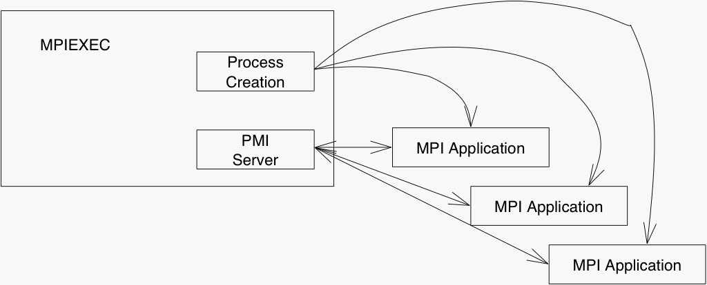
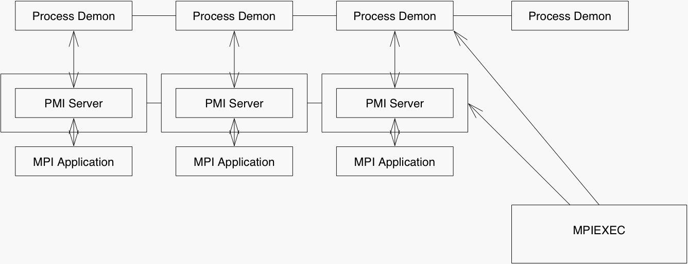

# PMI-2 Design Thoughts

The PMI interface has worked well as an abstract interface supporting
process management functions, particular for MPI-1 programs. Experience
in MPICH has shown some limitations with respect to MPI-2 functions,
including dynamic process management, singleton init, and multi-threaded
applications. This document reviews some of the issues and makes some
suggestions. The document is divided into four parts: Issues and
limitations of the current PMI interface, Changes to the PMI Client API,
Changes to the PMI Wire Protocol, and Interaction of PMI, mpiexec, and
applications.

## Issues and limitations of the current PMI interface

As originally designed, PMI provided a unified API for three distinct
groups of functions:

1.  Process management, used to start, stop, and abort processes
2.  Information about the parallel job, such as the rank and number of
    processes
3.  Exchange of connection information (this is the Key-Value-Space or
    KVS set of routines in PMI)

Experience has shown that the second of these (information about the
parallel job) needs to add "Information about the compute node", this is
needed to support topology information and optimizations for SMPs. These
have been grouped together because a process manager is in an excellent
position to support all of these services. However, man process managers
only provide the first of these; some also provide facilities for
implementing the second. With the exception of MPD (and some Grid
process managers), no process manager provides the facilities for
implementing the third (KVS) routines. The next version of PMI needs to
address the following issues, arranged by primary issue:

## API changes

1.  Modularity. The PMI interface contains two major sets of functions.
    One manages processes (starts, stops, and possibly signals). The
    other manages information that is used by processes to exchange
    information used to contact each other, as well as supporting the
    MPI name publishing features (the "KVS" features). While some
    process managers may provide both sets of services, others may only
    provide the basic process management functions. To allow MPICH to
    fit easily into such environments, a clean separation of these
    functions is needed. One test would be an implementation that used
    Bproc on a cluster to start processes and provided some other
    mechanism (such as LDAP or a separate distributed information
    manager) to implement the KVS routines.
2.  Thread safety. The PMI routines are blocking and the current
    implementation assumes that only one thread at a time will call
    them. This violates the spirit if not the letter of the MPI
    standard; for example, in the current implementation, a call to
    MPI_Comm_spawn will block any other thread from executing a PMI
    call until the spawn completes.
3.  Error returns from PMI operations (such as spawn) that may return
    multiple error codes. The error codes need to be efficiently
    integrated into the PMI wire protocol, and these error codes must be
    be convertible into MPI error codes.
4.  Error codes from PMI routines should be MPI error codes rather than
    PMI-specific error codes. The reason for this is to take advantage
    of the powerful and detailed MPI error reporting without requiring
    some duplicated error reporting system. In addition, using MPI error
    codes instead of having the MPI routines convert PMI codes into MPI
    codes (as in the current implementation).
5.  Info objects should not require any translation between the PMI and
    MPI layers. That is, there's no reason to have PMI define a
    different implementation of INFO objects than is used by MPI (if PMI
    was used by other tools, one could consider having a PMI-specific
    implementation of INFO. But like the error codes, there is little
    gained and much unnecessary complexity introduced by adding this
    flexibility.
6.  The current KVS design does not support dynamic processes in MPI.
    That is, the PMI_KVS_Get routine (and similar) cannot be used to
    get connection information about processes that are not in the
    MPI_COMM_WORLD of the calling process. This has lead to complex
    code within the CH3 implementation (which would need to be
    duplicated in other devices) that emulates the KVS routines. This
    part of the PMI interface should provide a way to make use of KVS
    when the MPI-2 dynamic process routines are included.
7.  Topology and other system information. The current MPICH
    implementation discovers that processes are on the same node by
    comparing their nodenames. This is both a non-scalable process and
    may not reflect the intent of the user (who may not want to exploit
    the "SMP"ness of the system, particularly when developing algorithms
    or testing code). Instead, this information should be communicated
    through the process manager interface into the MPI process. This
    requires a new PMI interface, and should be coordinated with the
    topology routines.

## Wire Protocol

1.  Backward compatibility is required, at least to detect protocol
    mismatches. It would be best if the first bytes exchanged by the PMI
    wire protocol established the PMI version and authentication, but
    that is not how the first version of PMI evolved. Any later version
    of PMI must at least identify PMI messages from earlier versions,
    and it must ensure that code implementing earlier versions of PMI
    can detect that a later version is being used, in order to generate
    a user-friendly error message.
2.  Security in the connection is required, since PMI commands can cause
    the system to start programs on behalf of the user. Of particular
    concern is a man-in-the-middle attack, particularly with message
    packets with forged sources and correctly predicted TCP sequence
    numbers.
3.  Singleton init. This is the process by which a program that was not
    started with mpiexec can become an MPI process and make use of all
    MPI features, including MPI_Comm_spawn, needs to be designed and
    documented, with particular attention to the disposition of standard
    I/O. Not all process managers will want to or even be able to create
    a new mpiexec process, so this needs to be negotiated. Similarly,
    the disposition of stdio needs to be negotiated between the singleton
    process and the process manager. To address these issues, a new
    singleton init protocol has been implemented and tested with the
    gforker process manager.
4.  Consistent command and response. A number of the commands return a
    value for success or failure, and some include a reason for failure,
    but the names and values of these names are not uniform. Many use
    "rc" for the return code and "msg" for the reason (if failure), but
    some use "reason" instead of "msg" and not all use "rc". A
    consistent set of names simplifies the code and ensures that errors
    are reliably detected and reported.

## Changes to the PMI Client API

There are a number of issues with the PMI client API. They can be
divided into three categories:

1.  Missing features
2.  Unneeded features
3.  Mismatches between the MPICH data structures and error values and
    the PMI versions.

To handle missing features, we need an way to extend the data that PMI
can provide. Rather than continue to introduce new routines (such as
`PMI_Get_universe_size`, we could use a general routine to fetch
attributes by name. This routine, along with a simplification of the
routines to acquire basic information, are described here:

  - `PMI_Get_Job_info` - Get information on the parallel job. Returns the rank, size, process
    group id, and parent info (if any). This replaces the individual
    routines that access these data.
  - `PMI_Get_Job_attr` - Get information about the parallel job for data that is not specific
    to the node on which the process is running. This routine is given a
    key and returns a value and a flag; the flag is true if the value is
    available and false otherwise. This provides an extensible mechanism
    for querying the context of the parallel job. The Intel PMI
    extension `get_ranks2hosts` (a wire-protocol operation without a PMI
    API) can be implemented with this extension. See Intel MPI Library
    Extensions to PMI Protocol for the Intel extension.
  - `PMI_Get_node_attr` - Provide an extensible way to access data about the process or job
    from the process manager. This replaces routines such as
    `PMI_Get_universe_size` and allows the definition of new extensions
    without further changing the PMI interface. Such extensions could
    provide information about the processor topology or busy-wait
    policy.

### Singleton Init Protocol

The process starts when either the client or the process manager
contacts the other. If the client starts, it sends a singinit command
and waits for the server to respond with its own singinit command. If
the server start, it send a singinit command and waits for the client to
respond with its own singinit command.

client sends singinit with these required values

` pmi_version=`<value of PMI_VERSION>
` pmi_subversion=`<value of PMI_SUBVERSION>

and these optional values

` stdio=[yes|no]`
` authtype=[none|shared|`<other-to-be-defined>`]`
` authstring=`<string>

server sends singinit with the same required and optional values as
above.

Based on the authentication type, additional message may ge exchanged.
In the case of `none`, there are no additional messages. At this point,
the protocol is now the same in both cases, and has the following
components:

server sends singinit_info with these required fields

```
versionok=[yes|no]
stdio=[yes|no]
kvsname=<string>
```

### Changes to the PMI Wire Protocol

The wire protocol may change to be something along these lines

1.  version information and authentication
2.  initialization
3.  commands
4.  close

After the version information (to maintain backward compatibility with
previous versions of PMI, at least at the level of reliably detecting
which version is in use), the messages use a length+string format for
messages, with everything a printing character. The length may be 6
printing characters (e.g., the characters 000102, not bytes representing
102 in bits).

If there is an escape character, it might be \`. Question: do we need an
escape character? We may if the commands are of the form "length
key=value".

## Related Issues

PMI and the Process Manager interact closely. The following are some
questions about the environment in which an MPI process runs, and how
that interacts with `mpiexec` and PMI.

  - How are limits (e.g., `unlimit core`) handled? Are these sent
    through the JobAttr interface, does PMI_Init do the

setup, or is this something managed directly by the process management
system when each user process is started?

  - What happens on process failure? What status is returned, and to
    whom? Do we try to return exit status? A vector of exit statuses? Do
    we try to identify the first process that failed?

  - Which signals are propagated to the process? Is there a list? A way
    to Query?

  - Is there a way to interpose a different process between `mpiexec`
    and the user's program?

  - Is there a way to register resources (e.g., SYSV shared memory
    segments)? E.g., a PMI_NodeRegisterResource( type, name-or-handle
    )?

  - Who, if anyone, handles the staging of executables?

  - Who, if anyone, verifies consistent shared and/or dynamically loaded
    libraries? What if PMI is itself a DLL?

### Interaction of PMI, mpiexec, and applications

Below are two figures that show different implementations of the process
manager and how it interacts with what is called here a "parallel
process creation" system.

Below is an example where `mpiexec` provides all of the PMI services. In
turn, `mpiexec` may invoke specialized parallel process creation calls
(such as are provided by PBS) to create new processes.



Below is an example that makes use of distributed PMI servers, with one
server per node. Also present on each node is a process creation demon,
such as a PBM "Mom" or an MPD demon. `mpiexec` contacts the process
creation demon to start the MPI processes and it contacts the PMI
servers to provide the PMI services.



These are just two of the possible implementation strategies. This
document, and the related PMI API and PMI Wire protocol documents, only
discuss the communication between the MPI application and whatever tool
is providing the PMI services.
