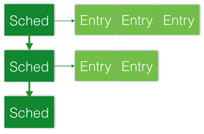

# The Progress Engine

The progress engine (TPE) is a series of lists for MPI internal tasks
such as: send, receive, collectives, and so on. It is designed for
asynchronous communications.

## Algorithm Pseudo Code

TPE is implemented as `MPIDI_CH3I_Progress`.

```
do {
  /* make progress on receiving */
  /* make progress on sending */
  /* make progress on LMTs */
  /* make progress on NBC schedules */

  /* deal with blocking case */
  /* deal with multithreaded case */
} while (is_blocking)
```

### How TPE is used by MPICH?

TPE is called by both nonblocking calls like `MPI_Test` and blocking
calls like `MPI_Wait`. In nonblocking calls, the parameter `is_blocking`
is set to be FALSE, thus the polling is inside the user code. In
blocking calls, `is_blocking` is set to be TRUE, thus the polling is
inside the runtime.

## Receive Progress

### Algorithm of Receive Progress

```
/* receive progress */
try to get a cell by dequeuing receiving queue
if (cell) {
  if (in_fbox) {
    MPID_nem_handle_pkt();
  }
}
```

### Data Structures of Receive Progress

```
typedef struct MPID_nem_mem_region {
    ....
    MPID_nem_queue_ptr_t       *FreeQ;
    MPID_nem_queue_ptr_t       *RecvQ;
    MPID_nem_barrier_t         *barrier;
    MPID_nem_queue_ptr_t        my_freeQ;
    MPID_nem_queue_ptr_t        my_recvQ;
    ....
}
```

### Queue data structure

In nemesis, there are two versions of queue implementation. One is
lock-free, the other is using lock.

```
typedef struct MPID_nem_queue
{
    MPID_nem_cell_rel_ptr_t head;
    MPID_nem_cell_rel_ptr_t tail;
    MPID_nem_cell_rel_ptr_t my_head;
#if !defined(MPID_NEM_USE_LOCK_FREE_QUEUES)
    MPID_nem_queue_mutex_t lock;
#endif
} MPID_nem_queue_t, *MPID_nem_queue_ptr_t;
```

## Send Progress

## LMT Progress

## Nonblocking Collective Progress

The schedule list of nonblocking collective schedules is a two-level
linked list: the first level is a linked list of `struct MPIDU_Sched`;
and each `struct MPIDU_Sched` is an array of `struct MPIDU_Sched_entry`.
Codes are located in `mpid_sched.c`. The list is defined as a static
variable `all_schedules` in this file.



### Data Structures & APIs

Following are the data structures used in the progress engine and the
APIs to access the data structures.

- The Schedule List - Functions that Directly Access `all_schedules`
- `MPIDU_Sched_are_pending` - Read only. Check if `all_schedules` is empty.
- `MPID_Sched_next_tag` - Read only. Check the tags in `all_schedule`.
- `MPID_Sched_start` - Append an entry to the schedule list.

```
MPL_DL_APPEND(all_schedules.head, s);
```

- `MPIDU_Sched_progress_state` - Process the schedule list, delete a schedule if all its entries have
  been processed.

```
/* process the list */
MPL_DL_FOREACH_SAFE(state->head, s, tmp) {
    for (i = s->idx; i < s->num_entries; ++i) {
        /* process entries */
    }
    if (s->idx == s->num_entries) {
        MPL_DL_DELETE(state->head, s);
    }
}
```

`MPIDU_Sched_progress_state` is called by `MPIDU_Sched_progress`.

#### The Schedule Object

- `MPID_Sched_create` - Create a new schedule object.
- `MPIDU_Sched_add_entry` - Add an entry to a schedule.

#### The Schedule Entries

Each schedule has an array of entries. The data structure of an entry is
as follows:

```
struct MPIDU_Sched_entry {
    enum MPIDU_Sched_entry_type type;
    enum MPIDU_Sched_entry_status status;
    int is_barrier;
    union {
        struct MPIDU_Sched_send send;
        struct MPIDU_Sched_recv recv;
        struct MPIDU_Sched_reduce reduce;
        struct MPIDU_Sched_copy copy;
        /* nop entries have no args */
        struct MPIDU_Sched_cb cb;
    } u;
};
```

`type` is used for handling different situations in the progress
engine. Different types are called differently depend on which type they
are (see
[MPIDU_Sched_start_entry](#mpidu-sched-start-entry) and
[MPIDU_Sched_progress_state_2](#mpidu-sched-progress-state_2)
). The following is a list of entry types:

```
enum MPIDU_Sched_entry_type {
    MPIDU_SCHED_ENTRY_INVALID_LB = 0,
    MPIDU_SCHED_ENTRY_SEND,
    MPIDU_SCHED_ENTRY_RECV,
    MPIDU_SCHED_ENTRY_REDUCE,
    MPIDU_SCHED_ENTRY_COPY,
    MPIDU_SCHED_ENTRY_NOP,
    MPIDU_SCHED_ENTRY_CB,
    MPIDU_SCHED_ENTRY_INVALID_UB
};
```

`status` is used for handling different stages of a schedule entry.
SEND and RECV entries will change their status from `NOT_STARTED` to
`STARTED`, then to `COMPLETE`. `REDUCE`, `COPY` and `CB` entries will
change directly from `NOT_STARTED` to `COMPLETE` in
`MPIDU_Sched_start_entry`.

```
enum MPIDU_Sched_entry_status {
    MPIDU_SCHED_ENTRY_STATUS_NOT_STARTED = 0,
    MPIDU_SCHED_ENTRY_STATUS_STARTED,
    MPIDU_SCHED_ENTRY_STATUS_COMPLETE,
    MPIDU_SCHED_ENTRY_STATUS_FAILED, /* indicates a failure occurred while executing the entry */
    MPIDU_SCHED_ENTRY_STATUS_INVALID /* indicates an invalid entry, or invalid status value */
};
```

`is_barrier` is used to control the calling order of the entries in
a schedule. The entries marked as `is_barrier` will not surpass its
predecessor. It will control the behavior of a entry in function
`MPIDU_Sched_continue` and `MPIDU_Sched_progress_state`.

##### MPIDU_Sched_start_entry

All types are called inside `MPIDU_Sched_start_entry`. It is called in
the following order:

```
MPID_Sched_start
MPIDU_Sched_continue
MPIDU_Sched_start_entry
```

For entries with a `SCHEDULE/COPY/CB` type, their status will be changed
from `NOT_STARTED` to COMPLETE after the call.

For entries with a `SEND/RECV` type, their status will be changed from
`NOT_STARTED` to `STARTED`.

##### MPIDU_Sched_progress_state

Only `SEND` and `RECV` are called inside `MPIDU_Sched_progress_state`
because only the entries in these two types has three status instead of
two, as mention before.

##### MPID_Sched_barrier

`MPID_Sched_barrier` mark its predecessor entry's `is_barrier` as 1.

### Algorithm

The progress engine is a part of non-blocking calls to overlap
computation and communication. In order to achieve overlap, a
non-blocking calls only adds an schedule to the progress engine and
returns immediately.

The question is: when is the progress engine called? See following
examples:

- `MPI_Comm_idup`

The code snippet is like this:

```
for (i = 0; i < NUM_ITER; i++)
    MPI_Comm_idup(MPI_COMM_WORLD, &comms[i], &req[i])
MPI_Waitall(NUM_ITER, req, MPI_STATUSES_INGORE);
```

When `MPI_Comm_idup` is called, it registers a callback function
`gcn_helper` in the progress engine. This function is not called until
`MPI_Waitall` is called. The call stack is:

```
gcn_helper
MPIDU_Sched_start_entry
MPIDU_Sched_continue
MPIDU_Sched_progress_state
MPIDU_Sched_progress
MPIDI_CH3I_Progress
MPIR_Waitall_impl
MPI_Waitall
```

## Re-entering Problem

## Interaction with Threads

If TPE is called by multiple threads, It is likely that one thread could
monopolize TPE while other threads were waiting on the lock without any
progress. So at the end of TPE, the thread who owns TPE (and the lock)
will try to be nice by yielding TPE (and the lock) to other threads.

```
if (pollcount >= MPID_NEM_THREAD_POLLS_BEFORE_YIELD)
    MPIU_THREAD_CS_YIELD(ALLFUNC,);
```

### Thread Safety
- [Progress Engine](Making_MPICH_Thread_Safe.md#the-progress-engine)
