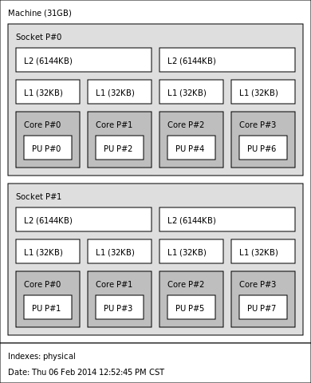

# Using the Hydra Process Manager

This wiki page only provides information on the external usage of
Hydra. If you are looking for the internal workings of Hydra, you can
find it [here](../design/Hydra_Process_Management_Framework.md).

## General

Hydra is a process management system for starting parallel jobs. Hydra
is designed to natively work with multiple daemons such as ssh, rsh,
pbs, slurm and sge.

## Getting Help

All of the runtime options can be listed on the command line using the
flag:

```
mpiexec -help
```

For further information about any specific flag, the information can be
obtained by adding the option before the help flag:

```
mpiexec -<option> -help
```

## Quick Start

Once built, the Hydra executables are in the bin subdirectory of the
install directory if you have done an install. You should put this (bin)
directory in your `$PATH` in your `.cshrc` or `.bashrc` for usage convenience:

```
Put in .cshrc:  setenv PATH /home/you/mpich/bin:$PATH

Put in .bashrc: export PATH=/home/you/mpich/bin:$PATH
```

To compile your application use mpicc:

```
mpicc app.c -o app
```

Create a file with the names of the machines that you want to run your
job on. This file may or may not include the local machine.

```
cat hosts
 donner
 foo
 shakey
 terra
```

To run your application on these nodes, use mpiexec:

```
mpiexec -f hosts -n 4 ./app
```

If the same application is run with 8 processes, it will use the hosts
in a round robin manner. For instance, with the above host file, ranks 0
and 4 will execute on donner, ranks 1 and 5 on foo, ranks 2 and 6 on
shakey and ranks 3 and 7 on terra.

The host file can also be specified as follows:

```
cat hosts
 donner:2
 foo:2
 shakey:2
 terra:2
```
In this case, ranks 0-1 will execute on donner, ranks 2-3 on foo, ranks
4-5 on shakey and ranks 6-7 on terra.

A more complex host file layout can be:

```
cat hosts
 donner:2
 foo:3
 shakey:2
```

In this case, the first 2 processes are scheduled on "donner", the next
3 on "foo" and the last 2 on "shakey". Comments in the host file start
with a `#` character.

```
cat hosts
 # This is a sample host file
 donner:2     # The first 2 procs are scheduled to run here
 foo:3        # The next 3 procs run on this host
 shakey:2     # The last 2 procs run on this host
```

You can spawn multiple different executables using:

```
mpiexec -f hosts -n 4 ./app1 : -n 4 ./app2
```

The first four ranks will be of "app1" and the next 4 ranks will be of
"app2".

## Environment Settings

By default, hydra passes inherits environment variables from the shell
on which mpiexec is launched, and passes it to the launched processes.
However, each launcher disables the automatic propagation of some
environment variables. For example, the SSH launcher disables the
propagation of `DISPLAY`, the SLURM launcher disables the propagation of
`SLURM_` variables, etc.

Users can force an environment variable to be propagated using the -genv
option.

Environment variables can also be used to control several settings in
Hydra.

- `HYDRA_HOST_FILE` - This variable points to the default host file to
   use, when the "-f" option is not provided to mpiexec.

  ```
    For bash:
      export HYDRA_HOST_FILE=<path_to_host_file>/hosts

    For csh/tcsh:
      setenv HYDRA_HOST_FILE <path_to_host_file>/hosts
  ```

- `HYDRA_DEBUG` - Setting this to `1` enables debug mode; set it to `0`
  to disable.

- `HYDRA_ENV` - Setting this to "all" will pass all of the launching
  node's environment to the application processes. By default, if nothing
  is set, the launching node's environment is passed to the executables,
  as long as it does not overwrite any of the environment variables that
  have been preset by the remote shell.

- `HYDRA_LAUNCHER_EXTRA_ARGS` - The value of this environment variable
  is appended to the launcher. This can be used, for example, to pass the
  `-q` argument to the launcher by setting `HYDRA_LAUNCH_EXTRA_ARGS=-q`.

- `MPIEXEC_TIMEOUT` - The value of this environment variable is the
  maximum number of seconds this job will be permitted to run. When time
  is up, the job is aborted.

- `MPIEXEC_PORT_RANGE` - If this environment variable is defined then
  Hydra will restrict its usage of ports for connecting its various
  processes to ports in this range. If this variable is not assigned, but
  `MPICH_PORT_RANGE` **is** assigned, then it will use the range
  specified by `MPICH_PORT_RANGE` for its ports. Otherwise, it will
  use whatever ports are assigned to it by the system. Port ranges are
  given as a pair of integers separated by a colon.

- `HYDRA_PROXY_RETRY_COUNT` - The value of this environment variable
  determines the number of retries a proxy does to establish a connection
  to the main server.

## Hydra with Non-Ethernet Networks

There are two ways to use Hydra with TCP/IP over the non-default
network.

The first way is using the -iface option to mpiexec to specify which
network interface to use. For example, if your Myrinet network's IP
emulation is configured on myri0, you can use:

```
mpiexec -f hostfile -iface myri0 -n 4 ./app1
```

Similarly, if your InfiniBand network's IP emulation is configured on
ib0, you can use:

```
mpiexec -f hostfile -iface ib0 -n 4 ./app1
```

You can also control this using the `HYDRA_IFACE` environment
variable.

The second way is to specify the appropriate IP addresses in your
hostfile.

```
/sbin/ifconfig

eth0  Link encap:Ethernet  HWaddr 00:14:5E:57:C4:FA
      inet addr:192.148.3.182  Bcast:192.148.248.255  Mask:255.255.255.0
      inet6 addr: fe80::214:5eff:fe57:c4fa/64 Scope:Link
      UP BROADCAST RUNNING MULTICAST  MTU:1500  Metric:1
      RX packets:989925894 errors:0 dropped:7186 overruns:0 frame:0
      TX packets:1480277023 errors:0 dropped:0 overruns:0 carrier:0
      collisions:0 txqueuelen:1000
      RX bytes:441568994866 (411.2 GiB)  TX bytes:1864173370054 (1.6 TiB)
      Interrupt:185 Memory:e2000000-e2012100

myri0 Link encap:Ethernet  HWaddr 00:14:5E:57:C4:F8
      inet addr:10.21.3.182  Bcast:10.21.255.255  Mask:255.255.0.0
      inet6 addr: fe80::214:5eff:fe57:c4f8/64 Scope:Link
      UP BROADCAST RUNNING MULTICAST  MTU:1500  Metric:1
      RX packets:3068986439 errors:0 dropped:7841 overruns:0 frame:0
      TX packets:2288060450 errors:0 dropped:0 overruns:0 carrier:0
      collisions:0 txqueuelen:1000
      RX bytes:3598751494497 (3.2 TiB)  TX bytes:1744058613150 (1.5 TiB)
      Interrupt:185 Memory:e4000000-e4012100

ib0   Link encap:Ethernet  HWaddr 00:14:5E:57:C4:F8
      inet addr:20.31.3.182  Bcast:10.21.255.255  Mask:255.255.0.0
      inet6 addr: fe80::214:5eff:fe57:c4f8/64 Scope:Link
      UP BROADCAST RUNNING MULTICAST  MTU:1500  Metric:1
      RX packets:3068986439 errors:0 dropped:7841 overruns:0 frame:0
      TX packets:2288060450 errors:0 dropped:0 overruns:0 carrier:0
      collisions:0 txqueuelen:1000
      RX bytes:3598751494497 (3.2 TiB)  TX bytes:1744058613150 (1.5 TiB)
      Interrupt:185 Memory:e4000000-e4012100

```
In the above case the 192.148.x.x IP series refers to the standard
Ethernet (or Gigabit Ethernet) network, the 10.21.x.x series refers to
Myrinet and the 10.31.x.x refers to InfiniBand.

```
cat hostfile-eth
 192.148.3.180
 192.148.3.181
 192.148.3.182
 192.148.3.183

cat hostfile-myri
 10.21.3.180
 10.21.3.181
 10.21.3.182
 10.21.3.183

cat hostfile-ib
 10.31.3.180
 10.31.3.181
 10.31.3.182
 10.31.3.183
```

To run over the Ethernet interface use:

```
mpiexec -f hostfile-eth -n 4 ./app1
```

To run over the Myrinet interface use:

```
mpiexec -f hostfile-myri -n 4 ./app1
```

## Resource Managers and Launchers

Hydra natively interacts with a number of resource managers and
launchers.

Resource managers provide information about the resources allocated by
the user (e.g., slurm, pbs, loadleveler, lsf, sge, cobalt). Launchers
allow mpiexec to launch processes on the system (e.g., ssh, rsh, fork,
slurm, pbs, loadleveler, lsf, sge). Some tools act as both resource
managers and launchers, while others play just one role.

**In most cases, you don't need to do anything special for Hydra to work
with your slurm, pbs, loadleveler, lsf, sge or cobalt environment. It'll
automatically detect these resource managers and interact with them. The
following command will be sufficient to launch processes on all the
allocated cores:**

```
mpiexec ./app
```

The above command will allow Hydra to inherit information about the
resource manager and launcher available, resources allocated from the
resource manager, and finally launch the appropriate number of
processes.

However, if you do not want Hydra to auto-detect the launcher, you can
customize it using the -launcher flag to mpiexec or the
`HYDRA_LAUNCHER` environment variable.

```
mpiexec -launcher ssh -f hosts -n 4 ./app
```

or

```
mpiexec -launcher fork -f hosts -n 4 ./app
```

The executable to use as the launcher can also be customized using the
option `-launcher-exec` or the `HYDRA_LAUNCHER_EXEC` environment
variable:

```
mpiexec -launcher ssh -launcher-exec /usr/bin/ssh -f hosts -n 4 ./app
```

Similarly, if you do not want Hydra to auto-detect the resource manager,
you can customize using the `-rmk` flag to mpiexec or the `HYDRA_RMK`
environment variable.

```
mpiexec -rmk pbs ./app
```

Finally, if you do not want Hydra to auto-detect the number of processes
allocated or the machines allocated, you can customize that using the `-n`
and `-f` flags.

```
mpiexec -rmk pbs -n 4 -f ~/hosts ./app
```

## Process-core Binding

On supported platforms, Hydra automatically configures available
process-core binding capability using
[hwloc](http://www.open-mpi.org/projects/hwloc/).
More info on how to use these options can be found in the help text:

```
mpiexec -bind-to -help
```

- `-bind-to <object[:num]>` - Specify the hardware element to
  bind each process to
- `-map-by <object[:num]>` - Skip over this many elements
  between bindings. If not specified, defaults to the same value as
  `-bind-to`.

Binding options can also be controlled with the environment variables
`HYDRA_TOPOLIB`, `HYDRA_BINDING`, `HYDRA_MAPPING`, and
`HYDRA_MEMBIND`.

### Examples

For the purposes of process binding/mapping examples, we will assume the
following machine topology.



Setting the env variable `HYDRA_TOPO_DEBUG = 1` will force hydra to
print out bindings, but not call the binding API. This is useful for
testing binding options using hwloc's arbitrary topology loading
feature, as is demonstrated below.

To bind processes to single hardware threads:

```
HYDRA_TOPO_DEBUG=1 mpiexec -n 8 -bind-to hwthread /bin/true | sort -k 2 -n
 process 0 binding: 10000000
 process 1 binding: 00100000
 process 2 binding: 00001000
 process 3 binding: 00000010
 process 4 binding: 01000000
 process 5 binding: 00010000
 process 6 binding: 00000100
 process 7 binding: 00000001
```

To bind processes to 2 cores at a time:

```
HYDRA_TOPO_DEBUG=1 mpiexec -n 8 -bind-to core:2 /bin/true | sort -k 2 -n
 process 0 binding: 10100000 
 process 1 binding: 00001010 
 process 2 binding: 01010000
 process 3 binding: 00000101 
 process 4 binding: 10100000
 process 5 binding: 00001010 
 process 6 binding: 01010000 
 process 7 binding: 00000101
```

A common use-case is to bind processes to a socket, and map by hwthread
to group sequential ranks together.

```
HYDRA_TOPO_DEBUG=1 mpiexec -n 8 -bind-to socket -map-by hwthread /bin/true | sort -k 2 -n
 process 0 binding: 10101010 
 process 1 binding: 10101010 
 process 2 binding: 10101010 
 process 3 binding: 10101010 
 process 4 binding: 01010101 
 process 5 binding: 01010101 
 process 6 binding: 01010101 
 process 7 binding: 01010101
```

Also included in the MPICH source is a program for printing out the
affinity of a process
([src/pm/hydra/examples/print_cpus_allowed.c](https://github.com/pmodels/mpich/blob/main/src/pm/hydra/examples/print_cpus_allowed.c))
according to the OS. This can be used on Linux systems to test that
bindings are working correctly.

```
mpiexec -n 8 -bind-to socket ./print_cpus_allowed | sort
 crush[0]: Cpus_allowed_list:    0,2,4,6
 crush[1]: Cpus_allowed_list:    1,3,5,7
 crush[2]: Cpus_allowed_list:    0,2,4,6
 crush[3]: Cpus_allowed_list:    1,3,5,7
 crush[4]: Cpus_allowed_list:    0,2,4,6
 crush[5]: Cpus_allowed_list:    1,3,5,7
 crush[6]: Cpus_allowed_list:    0,2,4,6
 crush[7]: Cpus_allowed_list:    1,3,5,7
```

## X Forwarding

X-forwarding is specific to each bootstrap server. Some servers do it by
default, while some don't. For ssh, this is disabled by default. To
force-enable it, you should use the option `-enable-x` to mpiexec.

```
mpiexec -enable-x -f hosts -n 4 ./app
```
## Checkpoint/Restart Support

Hydra provides checkpoint/restart capability. Currently, only BLCR is
supported. To use checkpointing include the `-ckpointlib` option for
mpiexec to specify the checkpointing library to use and `-ckpoint-prefix`
to specify the directory where the checkpoint images should be written:

```
mpiexec -ckpointlib blcr -ckpoint-prefix /home/buntinas/ckpts/app.ckpoint -f hosts -n 4 ./app
```

While the application is running, the user can request for a checkpoint
at any time by sending a `SIGUSR1` signal to mpiexec.

You can also automatically checkpoint the application at regular
intervals using the mpiexec option `-ckpoint-interval` to specify the
number of seconds between checkpoints:

```
mpiexec -ckpointlib blcr -ckpoint-prefix /home/buntinas/ckpts/app.ckpoint -ckpoint-interval 3600 -f hosts -n 4 ./app
```

The checkpoint/restart parameters can be controlled with the environment
variables `HYDRA_CKPOINTLIB`, `HYDRA_CKPOINT_PREFIX` and
`HYDRA_CKPOINT_INTERVAL`.

Each checkpoint generates one file per node. Note that checkpoints for
all processes on a node will be stored in the same file. Each time a new
checkpoint is taken an additional set of files are created. The files
are numbered by the checkpoint number. This allows the application to be
restarted from checkpoints other than the most recent. The checkpoint
number can be specified with the -ckpoint-num parameter. To restart a
process:

```
mpiexec -ckpointlib blcr -ckpoint-prefix /home/buntinas/ckpts/app.ckpoint -ckpoint-num 5 -f hosts -n 4
```

Note that by default, the process will be restarted from the first
checkpoint, so in most cases, the checkpoint number should be specified.

## Demux Engines

Hydra supports multiple I/O demux engines including poll and select. The
default is "poll". You can pick these through the mpiexec option `-demux`:

```
mpiexec -demux select -f hosts -n 4 ./app
```

This can also be controlled by using the `HYDRA_DEMUX` environment
variable.

## Debugging

Hydra natively supports parallel debuggers such as totalview and DDT.

You can debug the MPI application with totalview by launching it as:

```
totalview mpiexec -a -f hosts -n 4 ./app
```

The `-a` option is a totalview parameter which tells it that the
arguments after that need to be passed to mpiexec.

You can debug the MPI application with DDT by launching it as:

```
ddt mpiexec -a -f hosts -n 4 ./app
```

The `-a` option is a DDT parameter which tells it that the arguments
after that need to be passed to mpiexec.

For serial debuggers such as 'ddd', you can launch each process with a
separate debugger window as:

```
mpiexec -f hosts -n 4 ddd ./app
```
This will spawn four copies of `./app` each one launched under a
separate 'ddd' instance.

You can do something similar to 'ddd' for serial debuggers that do not
have a graphical interface, such as 'gdb', by launching them over
'xterm':

```
mpiexec -f hosts -n 4 xterm -e gdb ./app
```

If you want only the third process to run in a debugger, and the
remaining processes to run normally, you can do:

```
mpiexec -f hosts -n 2 ./app : -n 1 xterm -e gdb ./app : -n 1 ./app
```

## Using Hydra on Machines with Different User Names

Hydra only supports using different usernames on some launchers (such as
ssh and rsh). For this, the host file should contain a `user=<foo>`
entry.

```
cat hosts
 donner  user=foo
 foo     user=bar
 shakey  user=bar
 terra   user=foo
```

## Managing Output

For a moderate amount of output, `-prepend-rank` will add a `[$N]`
(where `$N` is a process's global rank) to each line of output.

For larger amounts of output `-outfile-pattern` (for stdout) and
`-errfile-pattern` (for stderr) can direct output to specific files

For example:

```
mpiexec -outfile-pattern=output.log-%r-%h -errfile-pattern=output.err-%r-%h
```

will create files with the global MPI rank `%r` and hostname `%h`
embedded in the name

## Name Publishing

In MPICH 3.1, Hydra is the default name service for MPI's name
publishing features (`MPI_PUBLISH_NAME/MPI_LOOKUP_NAME`). For
multihost programs to use this feature, you must first start a
`hydra_nameserver` process and tell mpiexec which host it is running on.

For example:

```
hydra_nameserver &
mpiexec -hosts myhost1,myhost2 -n 4 -nameserver myhost1 ./a.out
```
