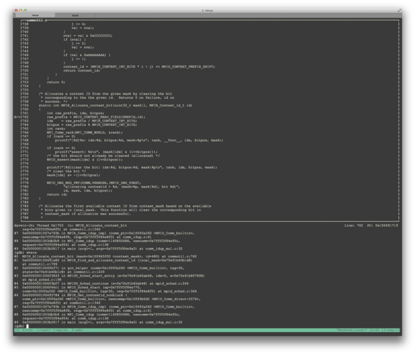

# Building MPICH For Development

When developing MPICH itself it is often useful to build the library
differently than you would for production use. This page aggregates
several tips and tricks for making your development life easier when
working with MPICH.

## Enable Debugging Symbols

Running `./configure` with flag `--enable-g=<option>` allows for the control 
of the debugging level in the MPICH implementation. Below is a list of available
options for the flag.

	- `none` - No debugging
	- `mem` - Memory usage tracing
	- `handle` - Trace handle operations
	- `dbg` - Add compiler flag `-g` to CFLAGS, CXXFLAGS, FFLAGS, and F90FLAGS
	- `log` - Enable debug event logging
	- `meminit` - Preinitialize memory associated structures and unions to
                  eliminate access warnings from programs like valgrind
	- `mutex` - Enable error checking on pthread mutexes
	- `all` - All of the above choices

## Configure With "strict"

MPICH is a very portable project and one of the only ways to ensure that
we are developing portable code on a permissive compiler like gcc is to
configure gcc to be as strict and pedantic as possible. The MPICH
configure provides an option to make this easy: `--enable-strict`.

It is recommended to use `--enable-strict=all` or `--enable-strict=posix` 
for those situations where `all` is too constraining and you know what you
are doing. This strictness will also help to catch general programming
errors, not just portability issues.

## Using gdb

When debugging MPICH, you may want to use `gdb` to step into the code to
see what's going on inside the code, whether to check out a variable or
to track a segmentation fault. Here are several tips for you to use
`gdb` in MPICH development.

### Remove `-O2` flag

The default cflag of MPICH, `-O2`, will change the instruction order of
your application. It will cause `gdb` jump to unexpected lines in your
code when you doing stepping. The solution is to configure with

```
--enable-fast=O0
```

Another way of doing this is to change the flags in
[config.site](http://stackoverflow.com/questions/3116645/default-compiler-flags-with-autotools).

### Debugging Multiple Processes

For general information of how to debug an MPI program, see
[discussion](http://stackoverflow.com/questions/329259/how-do-i-debug-an-mpi-program)
here. Another discussion is
[here](http://lists.mcs.anl.gov/pipermail/mpich-discuss/2010-April/006966.html).

To debug multiple processes with  `gdb`, you need to have xterm
installed. Then you can launch multiple MPI processes in `gdb` with
following command:

```
mpiexec -n [number of processes] xterm -e gdb ./your_app
```

Or you want to launch `gdb` windows only for ranks 0 and 4.

```
mpiexec -n 1 xterm -e gdb ./your_app : -n  3 ./your_app : -n 1 xterm -e gdb ./your_app
```

A very simple way to attach `gdb` to a MPI process is to

1. Place an empty loop in your code: `while(a){}`
2. Use `ps` or `pgrep` to find your process id and attach `gdb` to it
3. Use `(gdb) set var a = 0` to jump out of the loop

Additionally, the default setting of xterm may be ugly. You may want
to [Configure xterm Fonts and Colors](../misc/Configure_xterm_Fonts_and_Colors.md).

### Text User Interface (TUI)

`gdb` provides a Text User Interface for you to show the source file, the
assembly output, the program registers and `gdb` commands in separate text
windows. Check it out in
[TUI](http://sourceware.org/gdb/onlinedocs/gdb/TUI.html). Here is a
screenshot. 



For mac users, you may need to build `gdb` from source because the default
`gdb` provided by apple does not support TUI.

### Building GDB for OS X

  - <http://sourceware.org/gdb/wiki/BuildingOnDarwin>
  - <http://www.opensource.apple.com/source/lldb/lldb-69/docs/code-signing.txt>

### Use DDD instead of GDB

If you are more comfortable with GUI-enabled debuggers, you may want to
use [DDD](http://www.gnu.org/software/ddd/) instead of `gdb`. The
corresponding commands for launching MPI process in ddd are:

```
mpiexec -n [number of processes] ddd ./your_app
mpiexec -n 1 ddd ./your_app : -n  3 ./your_app : -n 1 ddd ./your_app
```

### CGDB

A nice alternative to `gdb` TUI mode is [cgdb](http://cgdb.github.io/)
"The Curses Debugger". It's a curses front-end to `gdb`, with vi-like
navigation out of the box. Use it the same way you'd use `gdb`. `cgdb`
passes its command line arguments down to gdb.

### Compile Programs with -g

It is a little tricky to get the compiled binary support `-g`. See the
make process for cpi as a reference.

```
cd examples
make -n cpi
```

## Use -jN

Run `make -jN` where `N` is some number like 4 or 8. This only works
starting with MPICH2-1.5, since prior to that the build system used an
approach that was not parallel-make safe.

## Use ccache

When developing MPICH it's not uncommon to need to `make clean` or `make
distclean` fairly often for various reasons. One way to help reduce the
time drain that this can be is to use
[ccache](http://ccache.samba.org/). On my desktop this utility cuts my
build times in half or better. For setup just read the docs on the
ccache site, they are pretty good.

## Don't Build Unnecessary Code

If you know you won't need a particular feature of MPICH then you might
be able to disable it to speed up compilation or to prevent configure
from complaining. For example you can pick and choose from the following
list of systems that can be disabled:

```
--disable-fortran
--disable-cxx
--disable-romio
```

The first three are useful if you only need the MPI C language bindings.
They disable the Fortran and C++ bindings. The last one disables MPI-IO
support.

## Use VPATH Builds

You can build several versions of MPICH from the same source tree by
doing what's known as a ["VPATH build"](http://www.gnu.org/software/make/manual/make.html#General-Search).
Let's assume you have your source in some directory like:
`/foo/bar/mpich-trunk`. If you are using an git version of the code you
will need to do an ./autogen.sh in this source directory (see
[here](Getting_And_Building_MPICH#Setting_up_the_build_environment "wikilink")).

Now let's say that you want to build two versions, one with a supported
thread level of `MPI_THREAD_SINGLE` and one with `MPI_THREAD_MULTIPLE`.
You would create two directories that are **not** in the source
directory like `/foo/bar/single` and `/foo/bar/multiple`. Change to the
`single` directory and run

```
../mpich-trunk/configure --prefix=/foo/bar/single-installed --enable-threads=single
```

Then `make` and `make install`.

Next change to the `multiple` directory and issue the same commands but
replace "single" with "multiple" everywhere. You now have two builds of
MPICH from the same source tree.

## Platform specific build instructions

The following wiki pages contain additional platform-specific build
information.

  - [Blue Gene/Q](BGQ.md)
  - [x86 and POWER using the Parallel Environment Runtime Edition](PE_RTE)
