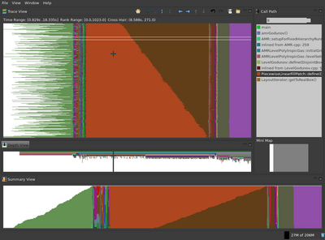
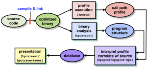
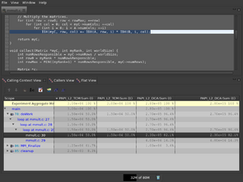
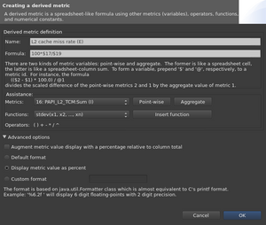
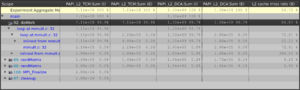
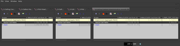
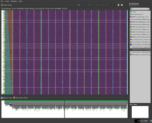

# HPCToolkit By Example



**HPCToolkit** is a suite of tools for tracing, profiling and analyzing
parallel programs. It can accurately measure a program's amount of work
and resource consumption, as well as user-defined derived metrics such
as FLOPS inefficiency and (lack of) scaling behavior. These metrics can
then be correlated with source code to pinpoint hotspots.

Being exclusively based on statistical sampling (instead of annotating
source code or intercepting MPI calls), it typically adds an overhead of
only 1-3% for reasonable choices of sampling periods, and can work with
fully optimized binaries. An optional (but recommended) pre-analysis of
the static program structure accounts for compiler transformations such
as inlining and pipelining, so that those performance metrics can be
more accurately associated with loops and functions even in a
highly-optimized binary.

Thanks to accurate callstack unwinding, it is possible to accurately
determine which particular callpath leads to a given performance
behavior, shifting blame from symptoms to causes. It also enables
fine-grained tracing to help identify e.g. load imbalance, understand
program behavior across nodes and time, etc.

## Installation

The toolkit may be downloaded from the
[official website](http://hpctoolkit.org/software.html),
as well as it's dependencies, which, for user convenience, have been
packaged in a single tarball, denoted `hpctoolkit-externals`. Binaries
for the visualization tools `hpcviewer` (for profiling), and `hpctraceviewer`
(for tracing) may also be downloaded from the same page; these need a
reasonably recent version of the java runtime (1.5.\* will suffice).

In this tutorial, we will be using all four packages from the website
above. Furthermore, we will make use of 
[PAPI 4.4.0](http://icl.cs.utk.edu/projects/papi/downloads/papi-4.4.0.tar.gz)
(see the section *Hardware counters* below).

First, build the `externals` package:

```
tar xzf hpctoolkit-externals-5.3.2-r3950.tar.gz
cd hpctoolkit-externals-5.3.2-r3950
mkdir build && cd build
../configure --with-mpi=$MPI_PATH
make install
```

Here we assume that MPI was installed in `$MPI_PATH`.

Finally we will build the main toolkit. Let `$EXT_PATH` be the path to
the external's `build` folder, and `$PAPI_PATH`

The procedure is then similar to before:

```
tar xzf hpctoolkit-5.3.2-r3950.tar.gz
cd hpctoolkit-5.3.2-r3950
mkdir build && cd build
../configure --with-papi=$PAPI_PATH [--with-mpi=$MPI_PATH]
make install
```

If MPICH2 is not in the `$PATH`, the additional flag
`--with-mpi=$MPI_PATH` must be passed (otherwise HPCToolkit will not be
built with MPI support). Before continuing, ensure that the following
line is in the configuration summary:

```
configure:   mpi support?: yes
```

Optionally the two visualizers may also be installed (on development
machines). In either case, the following command should be executed in
the uncompressed folder:

```
./install $HPCTOOLKIT_PATH
```

where, as expected, `$HPCTOOLKIT_PATH` is the folder where the main
toolkit above was installed (TODO: which is the default?).

More information, especially concerning different platforms, may be
found in the
[official instructions page](http://hpctoolkit.org/software-instructions.html).

## Numerical integration

This very short program estimates $\pi$ by using the method of
trapezoids with the following identity:

$\int_0^1\frac{4}{1+x^2}\ dx = \pi$

It is part of the MPICH2 source code distribution, and may be found at
`examples/cpi.c`.

As HPCToolkit is based on sampling, there is no need for manual source
code instrumentation. Compilation remains mostly unchanged; more
importantly, it is highly recommended to compile the target program with
debugging information and optimization turned on:

```
mpicc -g -O3 cpi.c -o cpi -lm
```

However, should the application be statically linked (such as on Compute
Node Linux or BlueGene/P), there is the extra step of linking with
`hpclink`.

```
hpclink `<regular-linker>` `<regular-linker-arguments
## For example:
hpclink mpicc -o cpi cpi.o -lm
```

(More information about static linking can be found in chapter 9 of the
[users manual](http://hpctoolkit.org/manual/HPCToolkit-users-manual.pdf).)

Next, we must recover the static program structure from the linked
binary, for which there is a tool named `hpcstruct`, typically launched
with no extra arguments:

```
hpcstruct ./cpi
```

This will build a representation of the program's structure in
`cpi.hpcstruct` (e.g. loop nesting, inlining) to be used later when
profiling/tracing, so that performance metrics may accurately be
associated with the correct code construct (be it a loop or a
procedure).



Execution differs in that `hpcrun` should be used to launch the
executable (in addition to mpirun):

```
mpirun -np 8 hpcrun `<hpcrun-args>` ./cpi
```

The argument for `hpcrun` will define which measurements will be made,
and how often. By default, `HPCToolkit` comes with a handful of events;
a list may be obtained via the following command:

```
hpcrun -L ./cpi
```

Events are passed as arguments of the form ` --event ` $e_i @ p_i$, where:

  - $e_i$ - Event identifier (`WALLCLOCK`, `MEMLEAK`, etc);
  - $p_i$ - Period in units meaningful to the event: microseconds for
    `WALLCLOCK`, cycles for `PAPI_TOT_CYC`, cache misses for `PAPI_L2_DCA`, etc.

(Statically linked applications set the environment variable
`HPCRUN_EVENT_LIST` instead, which uses the same format, and separes
events by a ';'. Please check the chapter referred to above.)

Now we pick a random metric to use, such as the performance of single
precision division:

```
mpirun -np 12 hpcrun --event WALLCLOCK@400000 --event PAPI_FDV_INS@10000 ./cpi
```

This will create a folder named `hpctoolkit-cpi-measurements`, with
entries for every rank used during runtime.

Finally, we combine the measurements with the program structure,
obtaining the final profiling database, using the command `hpcprof`:

```
hpcprof -S cpi.hpcstruct -I ./'*' hpctoolkit-cpi-measurements
```

The parameter `-I` should point to the folder containing the program's
source code. If it is distributed among several directories, the `*`
wildcard indicates that the directory should be searched recursively for
the code. Note the single quotes around `*`: that is used to prevent the
shell from expanding it into something else.

Much more information about any of these topics can be found in chapter
3 of the users manual.

## Hardware counters

If compiled with [PAPI](http://icl.cs.utk.edu/papi/) support, HPCToolkit
can record low-level events such as the number of mispredicted branches,
cache hits/misses and so on (to the extent supported by the hardware),
on a function/loop granularity. This information can help developers
find subtle, possibly architecture-specific performance bugs.
Additionally, HPCToolkit supports creating derived metrics from those
provided by PAPI, such as the difference between the FLOPS/cycle ratio
of a given loop, and the peak one seen during execution.

No modifications of the code (nor of the build process) are required to
support this; like any other event, those from PAPI are enabled at
run-time through the command-line argument `--event COUNTER_NAME@PERIOD`
to `hpcrun`. The command `papi_avail` lists all available hardware
counters on the processor, but only those listed using the `hpcrun -L`
command above can be used, as some of these are derived hardware metrics
(i.e. exposed as a convenience by PAPI, but not part of the processor's
counter interface).

For example, to sample floating point operations once every `400000`
operations, as well as the number of L2 cache misses once every `100000`
misses, when spawning a job with 12 ranks, the following command could
be used:

```
mpirun -np 12 hpcrun --event PAPI_FP_OPS@400000 --event PAPI_L2_TCM@100000 ./program
```

Derived metrics are defined at analysis time (i.e. using the visualizer
`hpcviewer`).

### Matrix-Matrix multiplication

In this example, we show how PAPI can be used to find an inefficient use
of cache in the context of matrix-matrix multiplications. The attached
[code](../text/Mmult.c) implements the
[naïve textbook algorithm](http://en.wikipedia.org/wiki/Matrix_multiplication#Matrix_product_.28two_matrices.29),
which is inefficient in the following sense. Since C/C++ are row-major,
when calculating $X = AB$, although we conceptually use $B$
column-wise, the memory system is in fact fetching a rectangular block
(whose height is that of the column, and whose length is determined by
the cache block size), of which we only use the first column. Since this
column is reused for every row of $A$, both of which may be very
large, by the time we actually start using the rest of said block it
will likely have been evicted to make space for $A$'s rows.

To measure this effect, the following counters will be used:

| Counter name  | Description            | Period |
| ------------- | ---------------------- | ------ |
| `PAPI_L2_TCM` | L2 cache misses        | 2500   |
| `PAPI_L2_DCA` | L2 data cache accesses | 2500   |

The period was chosen somewhat arbitrarily; short runs should use small
periods, whereas longer runs may increase it (though that might add
blindspots). We now compile, analyse, and execute the code as described
above:

```
mpicc -g -O3 -std=c99 -lm -o mmult mmult.c
hpcstruct ./mmult
mpirun -np 4 hpcrun --event PAPI_L2_TCM@10000 --event PAPI_L2_DCA@10000 ./mmult 32 64 128
```



This will randomly generate two `double` matrices, one of dimension
\(32x64\), and the other of dimension \(64x128\). It will then multiply
them using the naïve algorithm, where each rank is responsible for a
range of rows of the final product, and gather the result on rank 0.

The measurements made by `hpcrun` must now be combined with the source
code analysis to make the database, as described above. We then launch
the visualizer on the database.


```
hpcprof -S mmult.hpcstruct -I ./'*' hpctoolkit-mmult-measurements
...
hpcviewer hpctoolkit-mmult-database
```



We are interested in a new custom metric, the L2 cache miss rate, which
may be added via the following highlighted button:

![The (somewhat hidden) derived metric button.]
(../images/HpctkDerivedMetricButton.png "The (somewhat hidden) derived metric button.")

The menu is (literally) self-explanatory; we then add the desired
metric:

$\text{miss rate} = \frac{\text{number of L2 misses}}{\text{number of L2 accesses}}$.

As we ran with very small matrices, which may fit even in L1, the cache
miss rate is very small (5.56%). Increasing the size to something
larger, such as $2048x2048$, clearly shows the behavior described in
the beginning of this section: the miss rate is 94.62%.

So we should now try something slightly less naive:

1.  For every element $a_{ij}$ of $A$:
    1.  Load row $B_j$ of $B$;
    2.  Store product $a_{ij}B_j$ in row $C_i$.



This makes better use of the cache because the rows of $B$ are stored
(and accessed) sequentially, which is corroborated by the lower cache
miss rate of 54.83%.

Thanks to HPCToolkit's support for profiling hardware counters, such
techniques can easily be evaluated with no manual bookkeeping whatsoever
by the developer. Further, it can also help determine the impact of
these changes on different architectures.

## Weak/strong scaling

Another useful application of HPCToolkit is in determining scalability
of programs (and assigning blame on a function to function basis). We
reuse the more efficient matrix multiplication code above, first to
investigate slow scaling, and then strong scaling. Since now we are only
interested in execution time and number of cycles taken, we use the
following counters instead:

| Counter name   | Description                                         | Period |
| -------------- | --------------------------------------------------- | ------ |
| `PAPI_TOT_CYC` | Total cycles                                        | 10000  |
| `WALLCLOCK`    | Wall clock time used by the process in microseconds | 100000 |

The mathematics of the problem presents no obvious scaling (both weak
and strong) constraint for the algorithm, but HPCToolkit provides a very
straightforward way of verifying (or, in this case, refuting) intuition.

Starting with weak scaling (with 2 and 8 cores), we now define the
following derived metric for every context/function:

$\frac{\text{number of cycles taken for 8 cores} - \text{number of cycles taken for 2 cores}}{\text{total number of cycles taken for 8 cores}}$

This metric associates with every scope its contribution to the overall
scaling loss, i.e. how much longer the execution takes on 8-cores than
on 2-cores (despite the fact that every core does exactly the same
amount of work).

```
mpirun -np 2 hpcrun --event PAPI_TOT_CYC@10000 --event WALLCLOCK@100000 ./mmult 1024 1024 1024
hpcprof -S mmult.hpcstruct -I ./'*' hpctoolkit-mmult-measurements
```

After running `mmult` and `hpcprof` a second time (with 8 ranks), a
folder named `hpctoolkit-mmult-database-`<PID> will be created, where
PID is `hpcprof`'s second run's PID.



Both databases for the 2- and 8-core runs must now be merged so that
their components may be used to make new metrics. This is done by
opening them with the **File** menu, and then, on the same menu,
pressing **Merge databases**. Meanwhile, the main `hpcviewer` screen
should look as on the right. The rightmost view is of the merged
databases, so the previous two may safely be closed. We now proceed as
usual.

The new metric will use what is called an *aggregate metric*, which is
the sum of all elements in the column of a given existing metric,
(`PAPI_TOT_CYC` in our case); it is obtained, as described in the menu,
by replacing the `$` preceding the metric ID by a `@`.

As seen on the left, the program is not scaling well on a single node:
running a problem 4 times as big on 8 cores takes 3x as long. We suspect
the problem may lie on memory access contention among the cores.

## Tracing

To get tracing information, the flag `-t` should be passed to `hpcrun`.
To illustrate this, we use the
[example trace data](http://hpctoolkit.org/examples/hpctoolkit-chombo-crayxe6-1024pe-trace.tgz)
from the official website (which is much richer than any of our examples
here). We now point `hpctraceviewer` to the uncompressed folder:

```
hpctraceviewer hpctoolkit-chombo-crayxe6-1024pe-trace
```

The interface is relatively straightforward:



1.  **Trace view**: a regular timeline; whereas in
    [jumpshot](MPE_by_example.md) the nested functions are
    represented as nested rectangles, here they are merely represented
    with different colors, depending on the level selected on the...
2.  **Call path**: this indicates the maximum depth of the call path for
    every point in the timeline. Notice that, unlike jumpshop's *legend
    window*, this is not index by function but merely by callstack
    depth; in fact, some functions may appear more than once, with
    different colors. The callstack is determined by the position of the
    crosshead.
3.  **Depth view**: this is a plot of the above call path, per unit of
    time.
4.  **Summary view**: a collapsed view of the **trace view**,
    column-wise; this illustrates how much time is spent on each
    callpath depth.
5.  **Mini map**: a faster way of moving around/zooming in and out in
    the trace view.

## Platforms

### Blues

- install hpctoolkit

```
# install papi
./configure --prefix=$PWD/install-{blues,fusion} 2>&1 | tee config.txt
make -j8 2>&1 | tee m.txt
make install

# install hpctoolkit-externals
./autogen
mkdir build-{blues,fusion} ; cd build-{blues,fusion}
../configure --prefix=$PWD/install 2>&1 | tee config.txt
make -j8 2>&1 | tee m.txt
make install

# install hpctoolkit
./autogen
mkdir build-{blues,fusion} ; cd build-{blues,fusion}
../configure --prefix=$PWD/install --with-externals=PATH --with-papi=PATH 2>&1 | tee config.txt
make -j8 2>&1 | tee m.txt
make install
```

- use hpctoolkit

```
# Dynamically linked applications
[mpi-launcher] hpcrun [hpcrun-options] app [app-arguments]

# recover static program structure
hpcstruct app

# analyze measurements
hpcprof -S app.hpcstruct -I <app-src>/'*' hpctoolkit-app-measurements1 [hpctoolkit-app-measurements2 ...]

or

<mpi-launcher> hpcprof-mpi -S app.hpcstruct -I <app-src>/'*' hpctoolkit-app-measurements1 [hpctoolkit-app-measurements2 ...]

hpcviewer hpctoolkit-app-database
```

### Mira

<https://www.alcf.anl.gov/user-guides/hpctoolkit>

## Notes

We haven't thoroughly tested HPCToolkit 2.21.4 with PAPI-V; use 4.4.0 if
possible.

This may be found by typing `which mpicc` and removing `bin/mpicc` from
the resulting string.

If you're wondering why HPCToolkit doesn't use `-R` instead, it is
because it already has another meaning; check chapter 3 of the users
guide.

For some reason, HPCToolkit cannot use derived metrics.

The machine used to develop this example (with a core i7-2630QM) cannot
provide information on L1 cache accesses.

Notice that we count the total number of L2 cache misses, but only the
L2 data cache accesses. HPCToolkit unfortunately cannot profile using
derived metrics (such as L2 *data* cache misses); these can be found at
`papi_avail`. Thankfully, the most time-consuming computation in this
case is a very short loop, so the L2 instruction cache constitutes
around 1% of the total L2 cache misses.

Arguably, this is still high, but the point is to illustrate how to go
about measuring these things.

Taken from the HPCToolkit users manual.

Unfortunately the machine on which this was tested did not support
`PAPI_MEM_SCY`, which measures the number of cycles stalled waiting for
memory accesses.

## External links

  - [Main website.](http://hpctoolkit.org/)
  - [Users
    manual.](http://hpctoolkit.org/manual/HPCToolkit-users-manual.pdf)
    (Much of this text was inspired by, or outright hoisted from it)
  - [John Mellor-Crummey, Gaining Insight into Parallel Program
    Performance using
    HPCToolkit](https://computing.llnl.gov/tutorials/HPCToolkit.MellorCrummey.2012.08.07.pdf)
  - [Building and Installing
    HPCToolkit](http://hpctoolkit.org/software-instructions.html)
