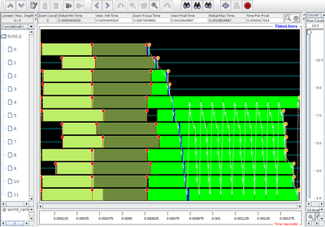
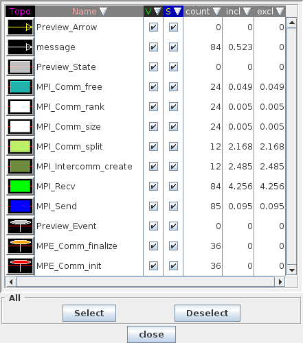
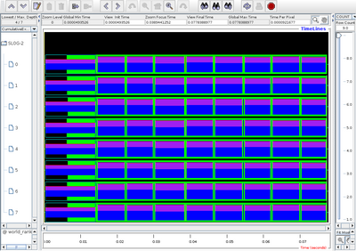
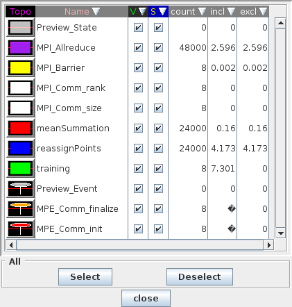
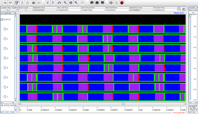

# MPE By Example


**MPE** is a set of postmortem profiling tools for use with MPI
programs. It consists mainly of *libmpe*, an instrumentation library,
and *Jumpshot*, its associated graphical visualizer. The most
straightforward way of using it is by linking against *libmpe*; one may
also insert logging calls in the target program's source code, thereby
increasing the level of detail available for analysis.

While usually associated with MPICH, it is implementation-agnostic and
works with OpenMPI, LAM/MPI as well as with commercial implementations,
such as IBM's and Cray's. Nevertheless, this document deals exclusively
with how it's used with MPICH2.

Instead of merely replicating the reference manual for MPE, we walk over
a number of examples.

## Installation

Despite what is stated on its
[official website](http://www.mcs.anl.gov/research/projects/perfvis/download/index.htm),
the most up-to-date release of MPE is only available bundled with
MPICH2, which may be found
[here](http://www.mcs.anl.gov/research/projects/mpich2/downloads/index.php?s=downloads).

In this tutorial, we'll be using MPICH2 version `1.4.1p1`; these
instructions have been tested on a new ubuntu `12.04.1` installation, as
well as Arch Linux, so they should be fairly distribution-independent
(for desktop users).

### Desktop linux (ubuntu 12.04.1)

**MPE**'s source code can be found at `src/mp2` from the MPICH2 source
code root:

```
cd src/mpe2
ls
    aclocal_core.m4      config.log     html           man
    aclocal_f77.m4       config.status  include        mpe_conf.h.in
    aclocal_inttypes.m4  config.sub     INSTALL        mpe.def
    aclocal.m4           configure      INSTALL.cross  mpe.vcproj
    aclocal_make.m4      configure.in   install-sh     mpewrap.vcproj
    aclocal_mpi.m4       cross_spec     lib            README
    autogen.sh           etc            maint          README.windows
    bin                  f77tmpdir      Makefile       sbin
    config.guess         fmpe.def       Makefile.in    src
```

We then make a separate build directory:

```
mkdir build
cd build
```

The next step depends on how MPICH2 was installed. If it was installed
on a separate prefix (say, `$HOME/mpi` - call it `$PREFIX`), you have to
add the arguments in brackets. If you don't know, check whether the
following command...

```
which mpicc
/usr/local/bin/mpicc
```

...returns the same path. If not, it was likely installed somewhere else
(the path of which you can see using the command above).

```
../configure --with-mpilibs="[-L$PREFIX/lib] -lmpich -lmpl" [--with-mpiinc="-I$PREFIX/include" --with-mpicc=$PREFIX/bin/mpicc]
```

For example, if MPICH2 was installed in `/opt/mpich2`, you should write
the following:

```
../configure --with-mpilibs="-L/opt/mpich2/lib -lmpich -lmpl" --with-mpiinc="-I/opt/mpich2/include" --with-mpicc=/opt/mpich2/bin/mpicc
```

If nothing goes wrong, you should be able to compile MPE with a simple
`make`.

To actually use MPE, you have three options:

- Install it on the default (or manually specified) prefix, just call
  `make install`.
- Otherwise, you may also setup your shell path so that the above
  installation is not required. Suppose you compiled MPE in
  `$HOME/mpich2/src/mpe2/build/`. You must then add the following line
  to your shell configuration file (usually `~/.bashrc`, `~/.zshrc`,
  etc, depending on which shell you use):

```
export PATH=$HOME/mpich2/src/mpe2/build/bin:$PATH
```

You must now either restart/open a new shell, or source the config file
above (usually a simple `source ~/.bashrc` will do).

- Specify the entire path to the build directory (not suggested - it
  may get very messy).

## Ring

This very simple application simulates a communication ring plus an
external "injection line". A message travels down the line from point to
point until the one denoted as the "injection point", whereupon it
enters the ring and loops a stated amount of times (from one ring
element to the next).

The source code can be downloaded [here](../text/Ring.c)
([makefile](../text/Makefile.ring)). The default
*Makefile* should do the link-time instrumentation explained above, so a
simple `make` suffices to get an executable which generates basic
profiling information for MPI calls. You can then run the program with
`mpirun -np 12 ./ring 4`. The argument passed to **ring** (e.g. `4`) is
the length of the injection line described above, so it should be lower
than the number of ranks. If all goes well, a log file called
`ring.clog2` should be produced in the same folder; this is an old
logging format that isn't used by Jumpshot, but for some reason is still
the default. You can then convert it using the `clog2TOslog2` tool which
is part of the MPE package, creating the file `ring.slog2`, which may
finally be visualized by calling `jumpshot ring.slog2`.



Each MPI rank gets its own timeline, indexed on the left, in which we
can see three main elements:

1.  <ins>Colored rectangles</ins> denote ***MPE states***.
    - These are periods of time during which the program is performing
      one particular piece of work, such as solving a linear system or
      writing something to disk.
2.  <ins>Colored ovals</ins> on top of a line represent ***MPE
    events***.
    - These represent atomic actions; usually they flank some state.
        - For instance, the events at the very end of each timeline
          mark the moment when each rank called `MPI_Finalize`.
    - As we will see in a bit, they can be used by calling `MPE_Log_event`.
        - MPE's special versions of the default MPI calls already do
          this internally, which is why we see the states in spite of
          not having touched the source code.
3.  <ins>White arrows</ins> designate ***message-passing*** between
    ranks.
    - Apparently they only appear between *send*s and *recv*s;
      collective calls are represented by events instead.

Unsurprisingly, we can clearly see from the picture the looping nature
of the program. Additionally, it is evident that little to no work is
being done other than sending/receiving messages, as \~40% of the
timeline is occupied by events related to communicator creation and
splitting, and the rest is taken mostly by receives. These take most of
the execution time precisely because it's a ring: every element has to
wait on a blocking *recv* until the messages loop around once.

As for basic manipulation of the timeline, since datasets usually are a
lot bigger than those from our simplistic example, you can also
selectively disable/enable different events/states, to e.g. reduce
clutter. This may be done by unticking the corresponding line in the
legend.



...and then pressing the somewhat hidden ***Redraw screen*** button (in
red):


Effectively every change you make needs to be applied by pressing
refresh.

Furthermore, you can obtain event statistics for given windows of time
by selecting the region of interest using the right mouse button...


...which then brings up a little window with timing information for the
range selected...


Pushing the "statistics" button produces an event histogram for the
chosen range:


## K-Means

The implementation for a simple k-means clustering algorithm is
surprisingly small (the main class has \~50 lines), which is one of the
reasons why it was chosen. It may be downloaded
[here](../text/Kmeans.cpp)
([makefile](../text/Makefile.kmeans)).

The gist of the algorithm is the following: for every one of $k$
*cluster centroids*, assign to its class all training points that are
closer to it than to every other *centroid*, and then update it to be
the mean point of all points assigned to its class. This is then
iterated a number of times, and hopefully we identify a set of
$k$ clusters in the original point data. For (much) more information
about k-means (especially its shortcomings), see the corresponding
[wikipedia entry](http://en.wikipedia.org/wiki/K-means).

As the only MPI calls made are two consecutive `MPI_Allreduce`, the
timeline generated by purely link-time instrumentation is rather bland:


Zooming-in reveals the collective calls:

")

Now it is evident that over half of the execution time is
unaccounted-for. We then seize this opportunity to employ source
code-based instrumentation.

We begin by flanking the call to the main method of the **KMeans**
class, namely `train`:

```c
g.train(trainingPoints, firstPoint, lastPoint);
```

First, we must get state eventIDs for our "training" label; these help
MPE keep track of when each state started/ended, and are automatically
provided by the MPE runtime to avoid conflicts. Next, we give a name to
these states that will be displayed in the legend window. Finally, we
provide a color for the corresponding timeline rectangle. The result can
be seen below.

```c
int train_eid_begin, train_eid_end;
MPE_Log_get_state_eventIDs(&train_eid_begin, &train_eid_end);
MPE_Describe_state(train_eid_begin, train_eid_end, "training", "green");
```

All that is left now is to actually perform this logging. This is easily
done by placing `MPE_Log_event` calls around the code section we want to
profile, such as:

```c
MPE_Log_event(train_eid_begin, 0, "training");
g.train(trainingPoints, firstPoint, lastPoint);
MPE_Log_event(train_eid_end, 0, "trained");
```

States may be logged within other states; the timeline will then show
these as one larger rectangle encompassing the smaller, inner one. Doing
this for all potential hotspots of the kmeans code, we obtain the
following timeline:





