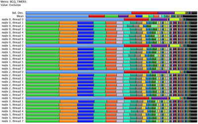
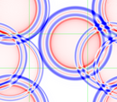
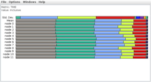
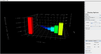
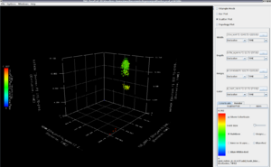
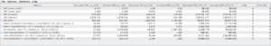

# TAU By Example



**TAU** (Tuning and Analysis Utilities) is a toolkit for profiling and
tracing parallel programs written in C, C++, Fortran and others. It
supports dynamic (library-based), compiler and source-level
instrumentation. Unlike MPE, TAU is not limited to profiling MPI code,
being geared towards parallel programming in general, including CUDA,
OpenMP and regular pthreads.

As TAU is already extensively documented, and this page will only provide a
short introduction to some common features, along with some basic example code.
See documentation below.

- <http://www.cs.uoregon.edu/Research/tau/docs/newguide/index.html>
- <http://www.tau.uoregon.edu/tau-wiki/Main_Page>
- <http://www.cs.uoregon.edu/Research/tau/docs.php>

## Installation

### Desktop linux (ubuntu 12.04.1)

After downloading both TAU and PDT from [here](http://www.cs.uoregon.edu/Research/tau/downloads.php),
unpack them wherever convenient and run the following command to configure,
compile and install TAU. If MPICH2/PDT were installed on another prefix,
the part within brackets must be appropriately setup: set `$MPI_PATH` to
the directory where MPICH2 was installed, and adjust `$PDT_DIR`
accordingly. Otherwise, it can be left out.

(If MPICH2 was configured with `--enable-shared`, it is not necessary to
pass the `-mpilibrary` argument below.)

```
./configure -mpilibrary='-lmpich -lmpl -lopa' [-mpilib=$MPI_PATH/lib -mpiinc=$MPI_PATH/include -pdt=$PDT_DIR]
make -j clean install
```

For more information, please refer to its
[installation manual](http://www.cs.uoregon.edu/Research/tau/docs/newguide/bk04ch01.html#installing.tau).

## Wave2D

### Description

 The *wave
equation* is a partial differential equation used to describe the
behavior of waves as they occur in physics:

${ \partial^2 u \over \partial t^2 } = c^2 \nabla^2 u\$

Here, the variable $u$ represents a physical measure such as pressure
or water depth. This equation can be discretized over a 2D grid using a
finite differencing scheme, leading to the following update rule:

$u_{x,y}^{t+1} = c^2 \left(u_{x+1,y}^{t}+u_{x-1,y}^{t}+u_{x,y+1}^{t}+u_{x,y-1}^{t}-4u_{x,y}^{t}\right)- u_{x,y}^{t-1} +2 u_{x,y}^{t}$

where $u$ is defined over a rectangular 2D grid in dimensions $x$,
$y$, and time step $t$. The constant $c$ defines the wave's
propagation speed.

We hence obtain the iterative five-point stencil code
[wave2d](../text/Wave2d.cpp).

### Profiling

A list of the different instrumentation methods used for e.g. profiling
(and which features they support) can be found
[here](http://www.cs.uoregon.edu/Research/tau/docs/usersguide/ch01.html).
We will cover three different methods:

1.  **Dynamic**: Statistical sampling;
2.  **Source**: Parser-aided automatic code categorization;
3.  **Selective**: Uses a separate file to "manually control which parts
    of the application are profiled and how they are profiled"; this is
    technically part of the **source** instrumentation above (and hence
    also requires PDT).

#### Dynamic instrumentation

The most straightforward way of getting started with TAU is through
`tau_exec`, which does dynamic instrumentation. This method makes use of
statistical sampling to estimate which percentage of the execution time
is taken by each function (as well as the absolute time spent). We first
compile as usual:

```
mpicxx wave2d.cpp -o wave2d
```

The difference occurs when executing the program, which is done as
follows:

```
mpirun -np 12 tau_exec ./wave2d 500 500 3 4 5`
```

Unfortunately, this method does not support profiling user-defined
routines, only those from MPI. For this reason, we do not recommend this
method for real-world applications (which very likely spend less time on
MPI calls than on computation itself, which would be unaccounted for).

#### Source instrumentation

If PDT is installed, it is possible to use the compiler wrapper scripts
`tau_cc.sh`/`tau_cxx.sh` to automatically instrument our code. In this
case, the difference is that one call to `TAU_PROFILE` is inserted in
every user-defined function, with this modified function's header.

First, we select which features we want TAU to use (e.g. MPI support,
tracing, CUDA hardware counters, etc), which is done by setting an
environment variable called `TAU_MAKEFILE` to point to one of the
(informatively-named) default *Makefiles* that are located in
`<TAU_HOME>/lib/`. For now, we only want to profile MPI code, so we
write:

```
export TAU_MAKEFILE=$TAU_HOME/lib/Makefile.tau-mpi-pdt
```

Next, to build the instrumented *wave2d* program, we replace the regular
`mpicc` or `mpicxx` commands by `tau_cc.sh` or `tau_cxx.sh`.

```
tau_cxx.sh wave2d.cpp -o wave2d
```

If all goes right, we can then execute the code as usual:

```
mpirun -np 12 ./wave2d 500 500 3 4 5
```

##### Compiler-based instrumentation

Additionally, TAU has a **compiler** instrumentation method, which sits
in between *dynamic* and *source*. Unlike *dynamic*, it requires
compilation, but also inherits some features from *source* such as being
able to profile user-defined functions. However, it cannot provide
information about finer constructs such as loops and so on. To use this
method, the argument `-tau_options=-optCompInst` should be added to
`tau_cc.sh`/`tau_cxx.sh` when compiling (or, equivalently, to the
`TAU_OPTIONS` environment variable); visualization and program execution
remain exactly the same.

In practice, we recommend installing PDT and using the *source* mode.

#### Selective instrumentation

A large program might have dozens of auxiliary functions that do not
constitute a significant chunk of the execution time, and hence visually
pollute the profile. Also, it may happen that a function will have two
or more time-consuming loops, which will not be individually represented
in the profile.

For this and other reasons we may want to selectively exclude functions,
annotate (outer) loops, etc, using TAU's support for selectively
profiling applications.

Consider the following example, which we will name `select.tau`:

```c
BEGIN_EXCLUDE_LIST

void foo(int *, double)
void barToo_#(int *)

END_EXCLUDE_LIST

BEGIN_INSTRUMENT_SECTION

loops file="random.cpp" routine="int FooClass::fooToo(double, double)"

END_INSTRUMENT_SECTION
```

Here, the symbol `#` in the function names acts as a wildcard.

To make use of this file, we define the `TAU_OPTIONS` environment
variable:

```
export TAU_OPTIONS="-optTauSelectFile=select.tau"
```

**Warning:** This does not as expected with regular C code. After every
function in the exclude list, a `C` should be added. Otherwise, a `#`
should be added after every function name.<U>This is a consequence of
the design used by TAU, and is effectively arbitrary</U>.

For some more information, check the [official manual](http://www.cs.uoregon.edu/Research/tau/docs/newguide/bk01ch01s03.html).

### Visualization

Regardless of the instrumentation method, we will then obtain a number
of `profile.r.*` files (`r` being a rank). These can now be visualized
in a number of manners.

#### pprof

Text-based; can be invoked by a simple `pprof`:

```
   % pprof
   Reading Profile files in profile.*

   NODE 0;CONTEXT 0;THREAD 0:
   ---------------------------------------------------------------------------------------
   %Time    Exclusive    Inclusive       #Call      #Subrs  Inclusive Name
                 msec   total msec                          usec/call 
   ---------------------------------------------------------------------------------------
   100.0        0.097        3,839           1           8    3839163 int main(int, char **) 
    98.5        0.172        3,783           1         200    3783485 void Grid::doIterations(int) 
    61.6        2,365        2,365         100           0      23653 void Grid::doOneIteration() 
    36.9            4        1,418         100         900      14181 void Grid::exchangeEdges() 
    36.8        1,412        1,412         100           0      14125 MPI_Waitall() 
     0.8            4           29           1           2      29727 void Grid::Grid(int, int, int, int, int) 
     0.6           24           24           1           0      24824 void Grid::initGrid(int) 
     0.5           18           18           1           0      18584 MPI_Finalize() 
     0.2            6            6           1           0       6387 MPI_Init() 
     0.0        0.931        0.931         400           0          2 MPI_Send() 
     0.0         0.84         0.84           1           0        840 void Grid::~Grid() 
     0.0        0.557        0.557         400           0          1 MPI_Irecv() 
     0.0        0.042        0.042           1           0         42 MPI_Bcast() 
     0.0        0.004        0.004           2           0          2 MPI_Comm_rank() 
     0.0        0.001        0.001           1           0          1 MPI_Comm_size() 
   ---------------------------------------------------------------------------------------

   USER EVENTS Profile :NODE 0, CONTEXT 0, THREAD 0
   ---------------------------------------------------------------------------------------
   NumSamples   MaxValue   MinValue  MeanValue  Std. Dev.  Event Name
   ---------------------------------------------------------------------------------------
            1          4          4          4          0  Message size for broadcast
   ---------------------------------------------------------------------------------------


   ... the same table for every rank ...


   FUNCTION SUMMARY (total):
   ---------------------------------------------------------------------------------------
   %Time    Exclusive    Inclusive       #Call      #Subrs  Inclusive Name
                 msec   total msec                          usec/call 
   ---------------------------------------------------------------------------------------
   100.0            1       46,076          12          96    3839746 int main(int, char **) 
    98.3            2       45,278          12        2400    3773202 void Grid::doIterations(int) 
    63.2       29,121       29,121        1200           0      24268 void Grid::doOneIteration() 
    35.1           49       16,154        1200       10800      13462 void Grid::exchangeEdges() 
    34.9       16,075       16,075        1200           0      13396 MPI_Waitall() 
     1.2           52          540          12          24      45051 void Grid::Grid(int, int, int, int, int) 
     1.1          487          487          12           0      40646 void Grid::initGrid(int) 
     0.2          106          106          12           0       8895 MPI_Finalize() 
     0.2           93           93          12           0       7759 MPI_Init() 
     0.1           48           48          12           0       4049 MPI_Bcast() 
     0.1           23           23        4800           0          5 MPI_Send() 
     0.0            8            8          12           0        686 void Grid::~Grid() 
     0.0            6            6        4800           0          1 MPI_Irecv() 
     0.0        0.035        0.035          24           0          1 MPI_Comm_rank() 
     0.0        0.008        0.008          12           0          1 MPI_Comm_size() 


... the same table, but now with mean values ...
```

More information about how to sort the data differently can be found by
doing `pprof -h`.

#### ParaProf

A much richer, graphical interface for visualization and analysis,
*ParaProf* can also be initialized simply by `paraprof`.



The vast majority of the functionality can be found by navigating the
menus. For instance, a graph of functions ordered by time taken on
average can be obtained by right-clicking `Mean` and selecting 
`Show Mean Bar Chart`.


Analogously, it is possible to see the execution time for a given
function on all ranks. A way of doing it is right clicking on the
corresponding function bar, and going to `Show Function Bar Chart`.
Alternatively, the menu `Windows-\>Function-\>Bar Chart` displays a list
of all profiled functions.

### Tracing

 In addition to profiling, TAU can automatically
instrument the code to do tracing without user intervention (unlike MPE,
which requires manual insertion of tracing code). This depends on PDT
(in particular, on its C/C++ parser), which is why we used a makefile
ending with *pdt* in the previous section. However, tracing is disabled
by default, so we enable it first:

```
export TAU_TRACE=1
```

(Note that this disables profiling, i.e. no `profile.*` files will be
generated.)

 Now the program can be executed normally (with
`mpirun` in this case), which will generate many `.edf` and `.trc`
files. These must then be merged as follows:

```
tau_treemerge.pl
tau2slog2 tau.trc tau.edf -o tau.slog2
```

All that is left is to visualizer the tracing data (tau.slog2) with
[Jumpshot](MPE_by_example.md) (or another such tool), as TAU
does not have a tracing visualizer. Notice on the legend window that all
functions have been automatically instrumented.

## Ring

![ParaProf plot for time spent per function/per rank]
(../images/TauRingAsyncProf.png "ParaProf plot for time spent per function/per rank")

This toy example implements a ring whose elements (ranks) asynchronously
send their successor a buffer whose size is dependent on their rank (as
well as the amount of work needed to prepare it). The image to the left,
which is a three-dimensional variation of the original 2D profiler
plotter (on the top of the page). It can be accessed by navigating to
`Window-\>3D Visualization`. The menu on the right has a few more plot
configurations; of note is the `scatter plot` option.

This buffer size dependence on the originating rank can also be seen in
the communication matrix, which may be enabled (before run-time) by
setting the environment variable `TAU_COMM_MATRIX`:



```
export TAU_COMM_MATRIX=1
```

From this graph it should be clear that the amount of communication
between a node and its successor is increasing approximately in
proportion to the square of the originating rank (the actual power is
$2.3$).

## NWChem

Here we focus on the scatter plot option on ParaProf. The idea of this
viewer is to help developers identify groups of functions whose running
time are tightly related. In the case of
[NWChem](http://www.nwchem-sw.org/index.php/Main_Page), this can be used
to help develop a time model for the (new) static load balancing
mechanism.

The horizontal axis of this 3D scatter plot shows the exclusive
execution time of the two dominant kernels in NWChem coupled cluster
simulations (`DGEMM` and `TCE_SORT`). The vertical axis shows the time
spent on dynamic load balancing.



We see that smaller tasks which take less time in the kernels take more
time dynamic load balancing. Also, we see that the reason this occurs is
possibly because of the size of the input data for the kernels - the red
colored points correspond to large operations that take more time in the
`GA_Accumulate()` operation compared to the green points.

## Hardware counters

Like [HPCToolkit](HPCToolkit_by_example.md#hardware-counters),
TAU can be built with PAPI support, which adds support for profiling
branching and cache access patterns, time stalled waiting for resources
(such as in memory reads), etc. The only change required in the
configuration phase above is the addition of the argument `-papi=`,
followed by the folder where PAPI was installed (say, `/`), e.g.:

```
./configure -mpilibrary='-lmpich -lmpl -lopa' -papi=/opt/papi
```

(The same comment above about MPICH2 and `--enable-shared` applies
here.)

This will produce a new TAU makefile, `Makefile.tau-papi-mpi-pdt`, which
should be used in the `export TAU_MAKEFILE=` commands above.

Up to 25 counters/events can then be recorded by exporting the
environment variables `COUNTER1` through `COUNTER25`, as follows:

```
export COUNTER1=PAPI_TOT_CYC
export COUNTER2=PAPI_FML_INS
export COUNTER3=PAPI_FMA_INS
```

Compilation and execution then proceeds exactly as usual. Instead of
producing a set of `profile.*` files, TAU will generate one folder for
each counter:

```
ls
MULTI__PAPI_TOT_CYC  MULTI__PAPI_FML_INS  MULTI__PAPI_FMA_INS ...
```



Paraprof can then be used to visualize the recorded metrics, as on the
left, under the **Windows/Thread** submenu. For a simple use case, see
the corresponding section on
[HPCToolkit](HPCToolkit_by_example.md#hardware-counters).

## Notes

Referred to as "binary rewriting" in TAU's manual.

The first two numbers are the dimensions for every rank's rectangle; the
next two are the number of rectangles in the $x$ and $y$ dimensions
(their product should be the number of ranks); the last is the number of
initial perturbations in the wave (i.e. the circles in the image above).

To see the modifications made by the TAU script, you can add
`-optKeepFiles` to the `TAU_OPTIONS` environment variable. The
instrumented code will be written to PROGNAME.inst.c if PROGNAME is the
executable's name, and similarly for C++.

Result from David Ozog, a PhD student from MCS/UOregon.

## External links

- [Main TAU website](http://www.cs.uoregon.edu/Research/tau/home.php)
- [TAU Wiki](http://www.tau.uoregon.edu/tau-wiki/Main_Page)
- [Original wave2d example](http://charm.cs.uiuc.edu/charm.git/examples/charm++/wave2d/)
